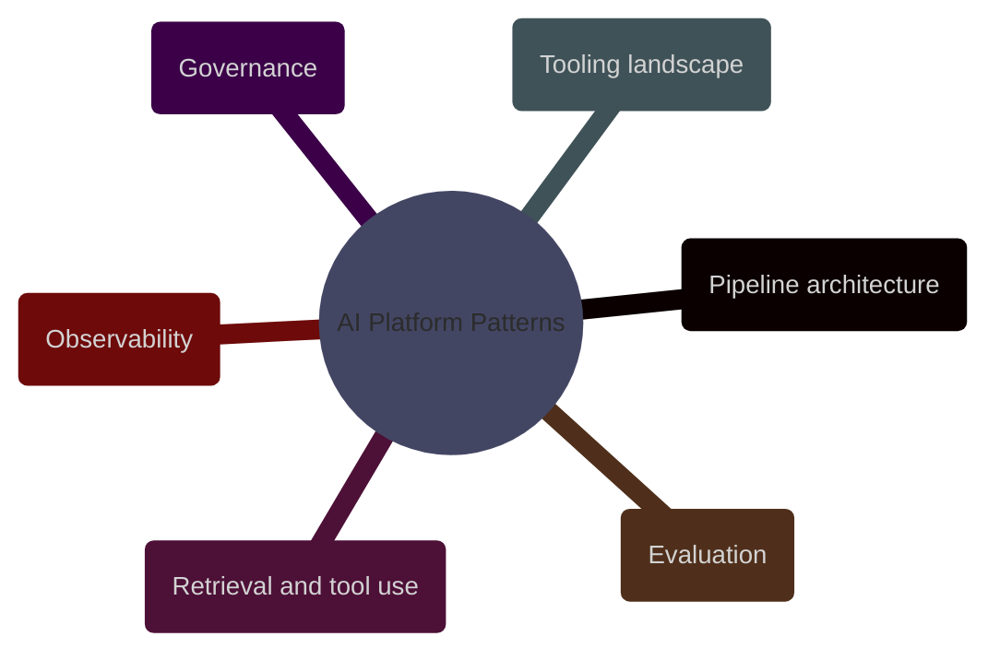

# AI Platform Patterns

This domain covers the platform surface around LLM systems: request flows, retrieval, tool use, evaluation, tracing, model routing, and the control boundaries that keep the system operable.

> [!abstract] [[01-llm-pipeline-architecture]]
>
> The architectural building blocks of production LLM systems, including request paths, retrieval paths, execution paths, fallbacks, retries, routing, and safe degradation.

> [!abstract] [[02-rag-retrieval-and-tool-use]]
>
> Retrieval, reranking, embeddings, citations, tool calling, MCP-style tool connectivity, and the decision boundary between asking a model to reason and asking a system to fetch or act.

> [!abstract] [[03-modern-ai-tooling-landscape]]
>
> A current view of inference gateways, vector search stacks, rerankers, orchestration frameworks, eval harnesses, tracing platforms, and guardrail tooling.

> [!abstract] [[01-ai-evaluation-and-quality-assurance]]
>
> Offline and online evaluation, golden datasets, retrieval metrics, extraction scoring, confidence thresholds, and review routing.

> [!abstract] [[02-ai-observability-and-operations]]
>
> Prompt traces, retrieval traces, token and cost telemetry, provenance, incident response, rollback criteria, and operational debugging of AI workflows.

> [!abstract] [[01-ai-governance-and-security]]
>
> Prompt injection, excessive agency, PII handling, secret leakage, vendor boundary decisions, approval gates, and financial-domain governance controls.
