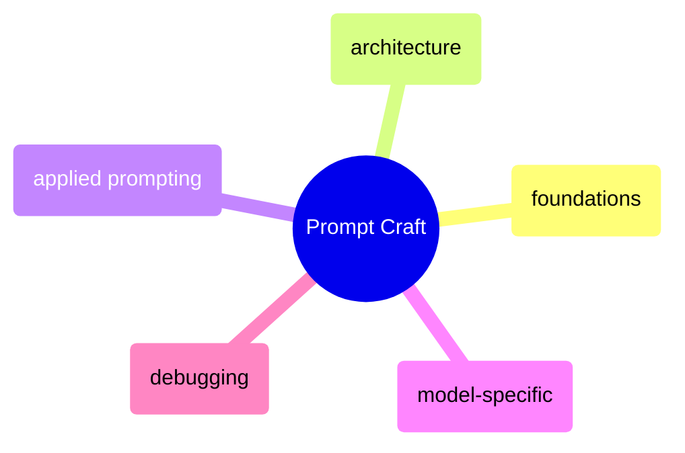

# Prompt Craft

Foundational prompting techniques, prompt architecture patterns, model-specific strategies, and systematic debugging workflows.

> [!abstract]- [[prompt-foundations]]
>
> - [[prompt-foundations#Core Principles of Prompt Engineering|Core principles and three axioms]]
> - [[prompt-foundations#Context Hierarchy and Priority Levels|Context hierarchy and priority levels]]
> - [[prompt-foundations#Clarity, Specificity, and Intent Alignment|Clarity, specificity, and intent alignment]]
> - [[prompt-foundations#How Structure Affects Reasoning, Creativity, and Factuality|Structure by task type]]

> [!abstract]- [[prompt-architecture]]
>
> - [[prompt-architecture#Layering: Role, Goal, Constraints, Format|The 4-layer template]]
> - [[prompt-architecture#Modular Structures: XML, JSON, Schemas, Paragraphs|XML, JSON, and paragraph formats]]
> - [[prompt-architecture#Chain of Thought Prompting|Chain of thought prompting]]
> - [[prompt-architecture#Meta-Prompting: Using AI to Improve Prompts|Meta-prompting]]

> [!abstract]- [[applied-prompting]]
>
> - [[applied-prompting#Research and Analysis|Research and analysis prompts]]
> - [[applied-prompting#Content Creation|Content creation prompts]]
> - [[applied-prompting#Code and Technical Tasks|Code and technical prompts]]
> - [[applied-prompting#Data Analysis and Extraction|Data extraction prompts]]
> - [[applied-prompting|Before and after optimization]]

> [!abstract]- [[model-specific-prompting]]
>
> - [[model-specific-prompting#Claude (Anthropic)|Claude prompting strategies]]
> - [[model-specific-prompting|GPT-4 prompting strategies]]
> - [[model-specific-prompting#Gemini (Google)|Gemini prompting strategies]]
> - [[model-specific-prompting#Grok (xAI)|Grok prompting strategies]]
> - [[model-specific-prompting#Cross-Model Portability Tips|Cross-model portability]]
> - [[model-specific-prompting#Model Selection Decision Tree|Model selection decision tree]]

> [!abstract]- [[prompt-debugging]]
>
> - [[prompt-debugging#Diagnosing Weak Outputs|Diagnosing weak outputs]]
> - [[prompt-debugging#Intent vs. Output Misalignment|Intent vs output misalignment]]
> - [[prompt-debugging#Rebuilding Prompts: Phrasing, Logic Steps, Reinforcement|Rebuilding prompts]]
> - [[prompt-debugging#Workflows, Loops, and Multi-Agent Systems|Workflows and multi-agent systems]]
> - [[prompt-debugging#Memory Layering and Iterative Refinement|Memory layering]]
> - [[prompt-debugging#Building a Prompt Library|Building a prompt library]]
