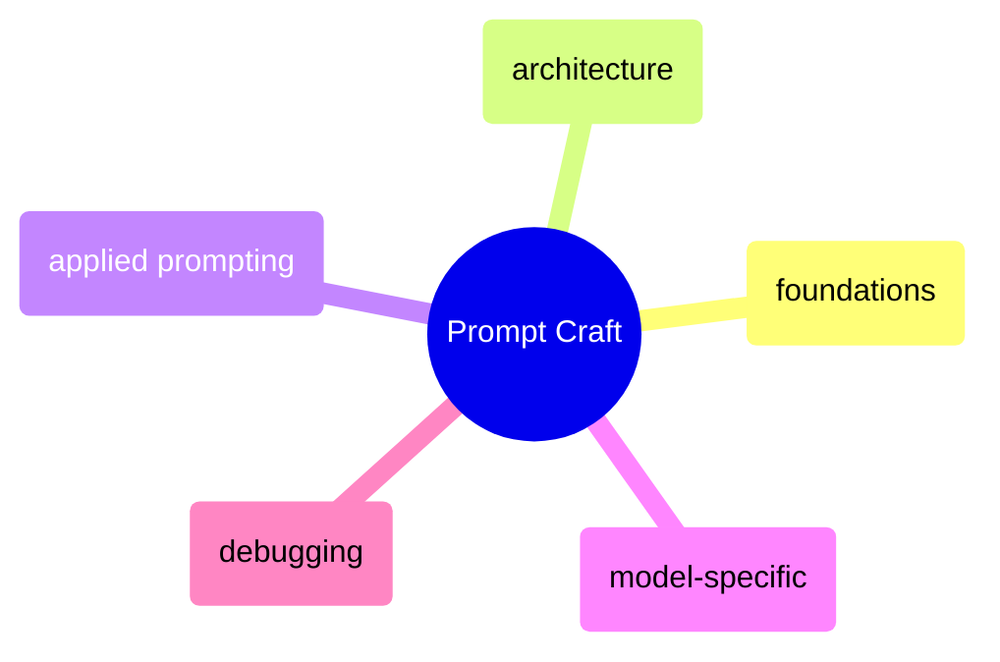

# Prompt Craft

Foundational prompting techniques, prompt architecture patterns, model-specific strategies, and systematic debugging workflows.

> [!abstract]- [[01-prompt-foundations]]

> [!abstract]- [[02-prompt-architecture]]

> [!abstract]- [[03-applied-prompting]]
>
> - [[03-applied-prompting|Before and after optimization]]

> [!abstract]- [[04-model-specific-prompting]]
>
> - [[04-model-specific-prompting|GPT-4 prompting strategies]]

> [!abstract]- [[05-prompt-debugging]]
