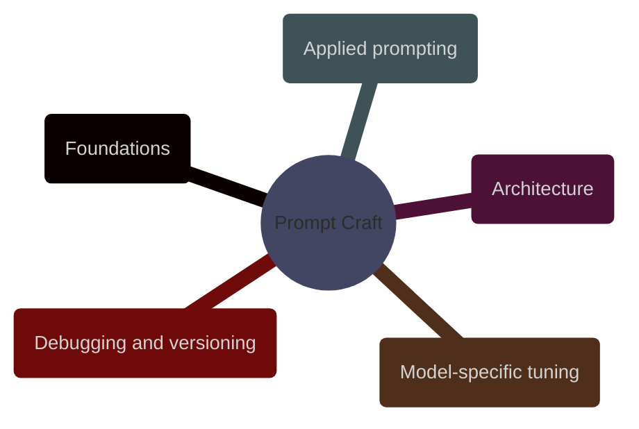

# Prompt Craft

Prompt craft is the discipline of turning a vague AI request into an explicit operating contract: what the model should do, what evidence it may use, what output shape it must respect, and how the result will be evaluated.

> [!abstract] [[01-prompt-foundations]]
>
> Core definitions for prompts, tokens, context, grounding, hallucinations, and instruction hierarchy, with finance-aware examples from ESG and index operations.

> [!abstract] [[02-prompt-architecture]]
>
> How to design prompt templates, delimiters, schema-bound outputs, decomposition patterns, and reusable prompt contracts for production systems.

> [!abstract] [[03-applied-prompting]]
>
> Prompt patterns for research, extraction, summarization, code review, SQL generation, and domain-specific workflows in data engineering and financial operations.

> [!abstract] [[04-model-specific-prompting]]
>
> How prompting changes across frontier hosted models, long-context models, reasoning-oriented models, and smaller local or task-specialized models.

> [!abstract] [[05-prompt-debugging]]
>
> How to diagnose bad outputs, build regression suites, version prompt changes, and decide whether the problem is the prompt, the model, the retrieval layer, or the surrounding application.
