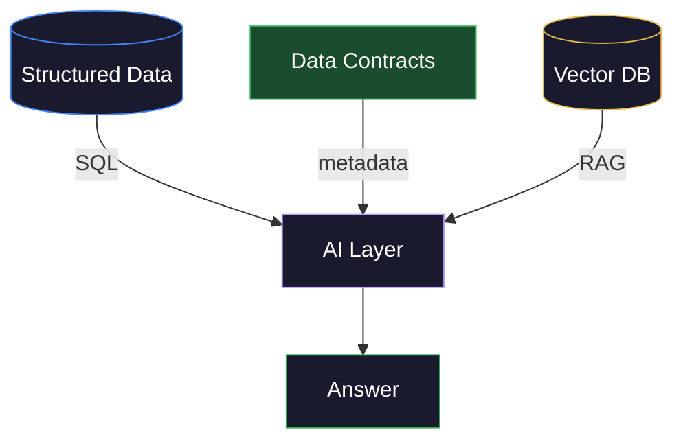

# AI-Augmented Data Engineering: LLM and RAG Pipelines

> [!quote]
> "AI is going to eliminate a lot of current jobs, and there will be classes of jobs that totally go away. AI is also going to create entirely new jobs."
> — **Sam Altman**
>
> "Just as the Industrial Revolution freed up a lot of humanity from physical drudgery, I think AI has the potential to free up humanity from a lot of the mental drudgery."
> — **Andrew Ng**

By 2026, senior data engineers are expected to transition from "builders" to "strategists" who integrate AI capabilities into data platforms. This does not mean becoming a machine learning engineer — it means understanding how to build the data infrastructure that powers LLM applications and how to use LLMs as tools within data pipelines.

## Where LLMs Fit in Data Engineering

LLMs are not replacements for SQL transforms or Airflow DAGs. They are specialized tools for tasks where rules-based logic fails — natural language understanding, unstructured data classification, and intelligent data quality explanations.

#### Practical LLM use cases for financial data engineers

| Use Case | Input | LLM Task | Output |
|---|---|---|---|
| **Corporate actions parsing** | Press release text | Extract: action type, ratio, effective date | Structured corporate action record (see [index-maintenance-and-corporate-actions](https://alp78.github.io/elysium/18-Financial-Domain/Market-Analysis/index-maintenance-and-corporate-actions)) |
| **Regulatory filing classification** | SEC/ESMA filing PDF (including [SFDR disclosures](https://alp78.github.io/elysium/18-Financial-Domain/Regulatory/sfdr-data-requirements)) | Classify: material change, routine, amendment | Category tag + confidence score |
| **Anomaly explanation** | "SAP dropped 15% today" + news | Generate explanation for data quality alert | Human-readable anomaly report |
| **Data quality remediation** | Failed validation rules + data sample | Suggest fix: is this a data error or a real event? | Remediation recommendation (augments [data-quality-framework](https://alp78.github.io/elysium/14-Data-Architecture/Pipeline-Patterns/data-quality-framework) checks) |
| **Schema documentation** | Table DDL + sample data | Generate column descriptions | Auto-populated data catalog entries |
| **Query generation** | Natural language question | Generate SQL | Validated SQL query |
| **Context-aware interpretation** | Gold table + data contract JSON | Interpret values using column metadata | Accurate analysis with correct units and formulas |

## RAG Architecture: Retrieval-Augmented Generation

RAG is the pattern of combining a retrieval system (search over your own documents/data) with an LLM (generation). It is how you give an LLM access to your internal documentation, pipeline logs, and data catalog without fine-tuning.


> [!abstract] RAG flow
> 1. **Embed** the user's question into a vector
> 2. **Search** the vector store for the most relevant document chunks
> 3. **Return** the top-K chunks as context
> 4. **Combine** the retrieved context + original question into a prompt
> 5. **Generate** a grounded answer using the LLM

#### The data engineering pipeline for RAG

```python
# Step 1: Document ingestion (data engineer's job)
from langchain.document_loaders import PyPDFLoader
from langchain.text_splitter import RecursiveCharacterTextSplitter

# Load corporate announcements, regulatory filings, earnings transcripts
loader = PyPDFLoader("press_releases/sap_q4_2025.pdf")
documents = loader.load()

# Chunk documents (critical parameter: too small = lost context, too large = irrelevant noise)
splitter = RecursiveCharacterTextSplitter(
    chunk_size=1000,        # characters per chunk
    chunk_overlap=200,      # overlap between chunks (preserves context at boundaries)
    separators=["\n\n", "\n", ". ", " "]
)
chunks = splitter.split_documents(documents)

# Step 2: Generate embeddings (convert text to vectors)
from langchain.embeddings import VertexAIEmbeddings

embeddings = VertexAIEmbeddings(model_name="text-embedding-005")
vectors = embeddings.embed_documents([chunk.page_content for chunk in chunks])

# Step 3: Store in vector database
import chromadb

client = chromadb.PersistentClient(path="/data/vector_store")
collection = client.get_or_create_collection(
    name="financial_documents",
    metadata={"hnsw:space": "cosine"}
)

collection.add(
    documents=[c.page_content for c in chunks],
    metadatas=[c.metadata for c in chunks],
    ids=[f"chunk_{i}" for i in range(len(chunks))],
    embeddings=vectors
)
```

## Using LLMs in Data Pipelines

> [!warning] Validate LLM extractions
>
> An LLM may extract the wrong split ratio (e.g., 1:4 instead of 4:1), invent an effective date, or misclassify a rights issue as a dividend. For index calculation pipelines, a wrong corporate action adjustment factor silently corrupts the entire price history. Treat LLM extraction as a first pass that must be confirmed against the vendor's structured data feed or a human review queue before it enters the pipeline.

#### Corporate actions extraction from press releases

Corporate actions (splits, dividends, mergers, spinoffs) arrive as unstructured press releases. Manually parsing them takes hours per filing and is error-prone. An LLM extracts structured fields — action type, ratio, effective date, currency — in seconds. The output feeds directly into the [corporate actions pipeline](https://alp78.github.io/elysium/18-Financial-Domain/Market-Analysis/index-maintenance-and-corporate-actions) where adjustment factors are computed.

```python
from anthropic import Anthropic

client = Anthropic()


def extract_corporate_action(press_release_text: str) -> dict:
    """
    Extract structured corporate action data from a press release.
    Replaces hours of manual data entry with seconds of LLM processing.
    """
    response = client.messages.create(
        model="claude-sonnet-4-6",
        max_tokens=1024,
        messages=[{
            "role": "user",
            "content": f"""Extract the corporate action from this press release.
Return a JSON object with these fields:
- company_name: string
- symbol: string (stock ticker)
- action_type: one of [SPLIT, DIVIDEND, MERGER, SPINOFF, RIGHTS_ISSUE]
- effective_date: YYYY-MM-DD
- ratio_numerator: integer (for splits)
- ratio_denominator: integer (for splits)
- dividend_amount: decimal (for dividends)
- currency: 3-letter code
- description: one-sentence summary

Press release:
{press_release_text}

Return ONLY valid JSON, no markdown formatting."""
        }]
    )

    import json
    return json.loads(response.content[0].text)

# Usage in pipeline:
action = extract_corporate_action("""
Deutsche Telekom AG announces a 1:4 stock split effective March 10, 2026.
Shareholders will receive 3 additional shares for each share held.
The ex-date is March 10, 2026. Trading on the adjusted basis begins
on the same date.
""")
# Returns: {"company_name": "Deutsche Telekom AG", "symbol": "DTE.DE",
#           "action_type": "SPLIT", "effective_date": "2026-03-10",
#           "ratio_numerator": 1, "ratio_denominator": 4, ...}
```

#### Data quality anomaly explanation

When a [quality gate](https://alp78.github.io/elysium/14-Data-Architecture/Pipeline-Patterns/data-quality-framework) flags an anomaly — a stock dropping 16% in a day, volume spiking 10x — the pipeline needs to decide: is this a real market event or a data error? An LLM cross-references the flagged value against recent news to classify the anomaly and recommend whether to accept or investigate. This replaces the manual triage step where an engineer googles the stock name to check for news.

```python
def explain_anomaly(symbol: str, metric: str, value: float, expected_range: tuple,
                    recent_news: list[str]) -> str:
    """
    When a data quality check flags an anomaly, use an LLM to determine
    if it's a real event or a data error.
    """
    news_context = "\n".join(f"- {n}" for n in recent_news[:5])

    response = client.messages.create(
        model="claude-sonnet-4-6",
        max_tokens=512,
        messages=[{
            "role": "user",
            "content": f"""A data quality alert was triggered:
Stock: {symbol}
Metric: {metric}
Value: {value}
Expected range: {expected_range[0]} to {expected_range[1]}

Recent news for {symbol}:
{news_context}

Is this anomaly likely a REAL MARKET EVENT or a DATA ERROR?
Explain in 2-3 sentences. End with a recommendation: ACCEPT (real event) or INVESTIGATE (possible error)."""
        }]
    )
    return response.content[0].text
```

---

## Validating LLM Outputs in Production

Calling an LLM API and parsing the response is the easy part. The hard part is trusting the output enough to feed it into a financial data pipeline — where a wrong extraction silently corrupts index calculations. The LLM is just another data source, subject to the same [contract-first validation](https://alp78.github.io/elysium/14-Data-Architecture/Pipeline-Patterns/functional-pipeline-architecture#contract-first-validation) rigor as Yahoo Finance or any vendor API.

### Structured Output Validation

The LLM returns text. Even with "Return ONLY valid JSON" in the prompt, the output may contain markdown fences wrapping the JSON, trailing text after the object, wrong field names, missing required fields, or nonsensical values (a stock split ratio of 1:1000).

> [!abstract] What is structured output validation?
> The same Pydantic/FluentValidation contract pattern used at pipeline stage boundaries, applied to LLM responses. Parse the raw text, validate against a typed model, quarantine on failure. The LLM doesn't know your enum values — the contract does.

```python
from pydantic import BaseModel, Field, ValidationError
from typing import Literal
from datetime import date
import json

class CorporateActionExtraction(BaseModel):
    """Schema that LLM output must conform to."""
    company_name: str
    symbol: str
    action_type: Literal["SPLIT", "DIVIDEND", "MERGER", "SPINOFF", "RIGHTS_ISSUE"]
    effective_date: date
    confidence: float = Field(ge=0.0, le=1.0)

def validate_llm_output(raw_text: str) -> CorporateActionExtraction | None:
    # Strip markdown fences the LLM may wrap around JSON
    cleaned = raw_text.strip().removeprefix("```json").removesuffix("```").strip()
    try:
        data = json.loads(cleaned)
    except json.JSONDecodeError as e:
        quarantine_llm_output(raw_text, f"JSON parse failed: {e}")
        return None
    try:
        return CorporateActionExtraction(**data)
    except ValidationError as e:
        quarantine_llm_output(raw_text, f"Schema validation failed: {e}")
        return None
```

> [!danger] LLMs Produce Confident Garbage
>
> An LLM that returns `{"action_type": "STOCK_SPLIT"}` instead of `"SPLIT"`
> passes JSON parsing but fails schema validation — the `Literal` constraint
> catches it. Without Pydantic at the boundary, this typo enters your pipeline
> as an unknown action type, silently breaking every downstream JOIN that
> filters on `action_type`.

### Confidence Scoring and Human Review

> [!abstract] What is confidence routing?
> The LLM includes a self-reported confidence score in its output. This is not reliable as an absolute measure, but it IS useful as a relative signal — the LLM tends to report lower confidence when the input is genuinely ambiguous. Route extractions to different paths based on confidence thresholds.

| Confidence | Action | Example |
|---|---|---|
| **High (>0.9)** | Auto-accept into pipeline | Clear stock split with explicit ratio |
| **Medium (0.5–0.9)** | Accept with flag for review | Ambiguous action, multiple interpretations |
| **Low (<0.5)** | Route to human review queue | Regulatory filing with no clear action type |

```python
extraction = validate_llm_output(response.text)
if extraction is None:
    return  # already quarantined

if extraction.confidence >= 0.9:
    ingest_to_bronze(extraction)
elif extraction.confidence >= 0.5:
    ingest_to_bronze(extraction, flagged=True)
    notify_review_queue(extraction, reason="medium confidence")
else:
    route_to_human_review(extraction)
```

### Regression Testing LLM Extractions

> [!abstract] What are golden file tests?
> A curated set of real inputs with verified correct outputs. When a model update or prompt change is deployed, the golden cases run automatically — any deviation from the expected output is caught before production. This is the LLM equivalent of the pipeline's [quality gate](https://alp78.github.io/elysium/14-Data-Architecture/Pipeline-Patterns/data-pipeline-testing-strategy).

```python
GOLDEN_CASES = [
    {
        "input": "Deutsche Telekom AG announces a 1:4 stock split...",
        "expected": {"action_type": "SPLIT", "ratio_numerator": 1,
                     "ratio_denominator": 4, "symbol": "DTE.DE"}
    },
]

@pytest.mark.parametrize("case", GOLDEN_CASES)
def test_extraction_matches_golden(case):
    result = extract_corporate_action(case["input"])
    for key, expected in case["expected"].items():
        assert result[key] == expected
```

### Prompt Versioning

The prompt IS the logic. When an extraction is disputed, you need to know which prompt version AND which model version produced it — the same [provenance principle](https://alp78.github.io/elysium/14-Data-Architecture/Pipeline-Patterns/functional-pipeline-architecture#data-provenance-and-lineage-tracking) from the pipeline architecture.

```python
import hashlib

EXTRACTION_PROMPT_V3 = """Extract the corporate action from this press release..."""
PROMPT_HASH = hashlib.sha256(EXTRACTION_PROMPT_V3.encode()).hexdigest()[:16]

run_context.prompt_version = PROMPT_HASH
run_context.model_version = "claude-sonnet-4-6"
```

> [!tip] Trace every LLM output
> `batch_id` traces a data row to its pipeline run. `prompt_hash` + `model_version` trace an LLM output to the exact prompt and model that produced it. Together they form a complete audit trail.

---

## Guardrails for Financial Data Pipelines

When LLM outputs feed into financial calculations, a wrong extraction corrupts index values, triggers incorrect corporate action adjustments, or produces misleading regulatory filings. The blast radius is far larger than a single bad row.

> [!danger] The 4:1 vs 1:4 Problem
>
> An LLM extracts a stock split ratio as 4:1 instead of 1:4. The adjustment
> factor is inverted: prices are multiplied by 4 instead of divided by 4.
> Every historical price is now 16x too high. Daily returns look normal
> (ratios are scale-invariant). Volatility looks normal. The error is
> invisible to every automated check — only a human comparing absolute
> price levels against an independent source catches it.

### Multi-Source Verification

> [!abstract] What is multi-source verification?
> For high-stakes extractions, the LLM result is treated as a **first pass** for speed. The vendor's structured feed (Bloomberg, Refinitiv) is the source of truth. The LLM adds value by processing press releases hours before the vendor data arrives — but the vendor data is the final confirmation. If they disagree, the vendor wins and the LLM extraction is flagged for prompt improvement.

```python
def verify_corporate_action(llm_extraction: dict, vendor_data: dict) -> bool:
    """Cross-check LLM extraction against vendor structured feed."""
    checks = [
        llm_extraction["action_type"] == vendor_data["action_type"],
        llm_extraction["effective_date"] == vendor_data["effective_date"],
        llm_extraction["symbol"] == vendor_data["symbol"],
    ]
    if llm_extraction["action_type"] == "SPLIT":
        llm_ratio = llm_extraction["ratio_denominator"] / llm_extraction["ratio_numerator"]
        vendor_ratio = vendor_data["split_factor"]
        checks.append(abs(llm_ratio - vendor_ratio) < 0.01)
    return all(checks)
```

### Constrained Output with Tool Use

> [!abstract] What is tool use?
> Instead of asking the LLM to return free-form JSON and validating after, **tool use** (also called function calling) forces the LLM to produce output conforming to a JSON Schema at generation time. The `action_type` MUST be one of the enum values, `effective_date` MUST be a date string, `confidence` MUST be between 0 and 1. This eliminates the entire class of "valid JSON but wrong field names" errors.

```python
response = client.messages.create(
    model="claude-sonnet-4-6",
    max_tokens=1024,
    tools=[{
        "name": "record_corporate_action",
        "description": "Record a corporate action extracted from text",
        "input_schema": {
            "type": "object",
            "properties": {
                "action_type": {
                    "type": "string",
                    "enum": ["SPLIT", "DIVIDEND", "MERGER", "SPINOFF", "RIGHTS_ISSUE"]
                },
                "effective_date": {"type": "string", "format": "date"},
                "symbol": {"type": "string"},
                "confidence": {"type": "number", "minimum": 0, "maximum": 1},
            },
            "required": ["action_type", "effective_date", "symbol", "confidence"]
        }
    }],
    messages=[{"role": "user", "content": f"Extract the corporate action: {text}"}]
)
```

> [!info] Tool Use vs Free-Form JSON
>
> **Free-form JSON:** the LLM can return ANY valid JSON — you validate after.
> **Tool use:** the LLM MUST return JSON matching your schema — validation is built in.
> For financial data, always prefer tool use — the schema constrains the output
> space and eliminates entire categories of extraction errors.

### Idempotent LLM Operations

LLM calls are non-deterministic — the same input can produce different outputs. For pipelines that must be [idempotent](https://alp78.github.io/elysium/14-Data-Architecture/Pipeline-Patterns/idempotent-pipeline-design) (safe to re-run), two patterns:

> [!info] Two idempotency patterns
> - **Cache by input hash** — hash the input text, check if an extraction exists for this hash. If yes, return cached. If no, call the LLM and cache. Same input always yields the same output.
> - **Record and compare** — on re-run, call the LLM again but compare against the previous extraction. If they differ on critical fields (action_type, ratio, date), flag for human review instead of silently overwriting.

---

## Self-Describing Data for AI Consumers

The sections above cover two directions of AI × data engineering: LLMs as tools inside pipelines (parsing, classification, anomaly explanation) and AI coding assistants for productivity. There is a third direction: **pipelines that produce structured metadata FOR AI consumers** — turning opaque numbers into self-describing data that any agent interprets correctly without guessing.

### The Interpretation Problem

An AI agent queries `gold_symbol_profile` and sees `volatility: 0.0187`. Without context, it faces four ambiguities:

- Is it a **percentage** (0.02%) or a **decimal ratio** (1.87%)?
- Is it **daily**, weekly, monthly, or **annualized**?
- What **formula** produced it — standard deviation of what, over what window?
- What does **NULL** mean — no data available, not applicable, or insufficient history?

The agent has three options: hallucinate an interpretation, refuse to answer, or ask a human. All are bad. The root cause is that the data is structurally correct but not self-describing.

### The Solution — Data Contracts with Column Context

> [!abstract] What is a data contract?
> A **data contract** is a formal agreement between a data producer and its consumers. It specifies the schema (column names and types), SLAs (freshness, availability), and — critically — **column semantics** (what each value means, how it was computed, what NULL represents). See [data-contracts](https://alp78.github.io/elysium/14-Data-Architecture/Pipeline-Patterns/data-contracts) for the full specification theory.

The pipeline exports a JSON Schema file alongside each gold table, enriched with `x-column-context` — structured metadata for every derived column:

```json
{
  "name": "volatility",
  "description": "Std dev of daily returns — annualize with √252",
  "unit": "decimal_ratio",
  "computation": "std(daily_return) per symbol",
  "source_columns": ["silver.daily_return"],
  "null_semantics": "insufficient_data",
  "valid_range": [0, 1]
}
```

> [!abstract] What is column context?
> **Column context** (`ColumnContext`) is a structured metadata model attached to each derived column. It records the description, unit of measurement, computation formula, source columns from the upstream layer, null semantics, and valid range. Unlike comments in code, column context is machine-readable — any consumer (dashboard, pipeline, LLM agent) can parse it programmatically.

With this contract, the AI agent's interpretation becomes deterministic:
1. Read the contract → unit is `decimal_ratio`, not percentage
2. Read the description → "annualize with √252"
3. Compute: `0.0187 × √252 × 100 = 29.7%` annualized volatility
4. Generate: "The annualized volatility of SAP.DE is 29.7%, computed as the standard deviation of daily close-to-close returns multiplied by √252."

No hallucination. No guessing. The interpretation comes from the contract, not from the model's training data.

> [!warning] Without Contracts — The Hallucination Risk
>
> Without the data contract, the LLM sees `volatility: 0.0187` and must guess
> what it means. Training data might suggest it's a percentage (wrong), annualized
> (might be wrong), or a Sharpe ratio (completely wrong). The agent produces a
> confident, articulate, incorrect answer. With the contract, the interpretation
> is deterministic — the metadata IS the ground truth, not the model's memory.

### The Context Architecture Behind It

The column context is not a one-off export — it's part of a broader **context architecture** that flows through the pipeline alongside the data:

> [!abstract] What is context propagation?
> **Context propagation** means that metadata created at one pipeline stage (bronze) is carried forward to downstream stages (silver, gold) via a `StageContext` carrier. Each stage inherits upstream warnings and adds its own. By gold, the context contains the full warning chain from every stage — zero-volume classifications from bronze, SMA null explanations from silver, and weight validation results from gold.

- **ColumnContext** models are defined per medallion layer, documenting every column's meaning, formula, sources, and null semantics
- These registries are attached to **StageContext** and propagated through the pipeline via `for_next_stage()`
- At export time, the column contexts are serialized into the JSON Schema contract as `x-column-context`

See [functional-pipeline-architecture > Context Architecture — Semantic Metadata Layer](https://alp78.github.io/elysium/14-Data-Architecture/Pipeline-Patterns/functional-pipeline-architecture#context-architecture--semantic-metadata-layer) for the full architecture and [functional-pipeline-architecture > Data Contracts as Consumer-Facing Output](https://alp78.github.io/elysium/14-Data-Architecture/Pipeline-Patterns/functional-pipeline-architecture#data-contracts-as-consumer-facing-output) for the export mechanism. For the broader theory covering five types of pipeline context, see [context-and-metadata-architecture](https://alp78.github.io/elysium/14-Data-Architecture/Architectures/context-and-metadata-architecture).

### AI Agent Workflow with Contracts

A practical example — an AI agent reads the contract before interpreting data:

```python
import json
from pathlib import Path
from anthropic import Anthropic

client = Anthropic()

# Load the data contract exported by the pipeline
contract = json.loads(Path("contracts/gold_symbol_profile_contract.json").read_text())
column_context = {c["name"]: c for c in contract["x-column-context"]}

# Read the data
german_stocks = query_gold("SELECT * FROM gold_symbol_profile WHERE symbol LIKE '%.DE'")

# Build a context-aware prompt — the LLM receives the metadata, not just the numbers
vol_ctx = column_context["volatility"]
prompt = f"""Interpret this data using the provided column metadata.

Column metadata for 'volatility':
- Description: {vol_ctx['description']}
- Unit: {vol_ctx['unit']}
- Computation: {vol_ctx['computation']}
- Null means: {vol_ctx['null_semantics']}

Data:
{german_stocks.to_json()}

Question: What is the average volatility of German stocks, and what does the number mean?
"""

response = client.messages.create(
    model="claude-sonnet-4-6",
    max_tokens=512,
    messages=[{"role": "user", "content": prompt}]
)
```

> [!tip] Deterministic vs probabilistic
> The column metadata in the prompt is **deterministic** — it comes from the pipeline's own export, not from the LLM's training data. The LLM's role is natural language generation (turning the metadata into a readable explanation), not data interpretation (guessing what the column means). This separation is what prevents hallucination.

**Implementations:**

| Component | Python | C# |
|---|---|---|
| ColumnContext model | [py](https://alp78.github.io/elysium/02-Programming-Languages/Python/25_py_functional_pipeline#pydantic--define-column-semantic-metadata-model-with-basemodel) | [cs](https://alp78.github.io/elysium/02-Programming-Languages/CSharp/25_cs_functional_pipeline#record--define-column-semantic-metadata-model-with-record) |
| Column registries | [py](https://alp78.github.io/elysium/02-Programming-Languages/Python/25_py_functional_pipeline#pydantic--define-column-registries-for-each-medallion-layer) | [cs](https://alp78.github.io/elysium/02-Programming-Languages/CSharp/25_cs_functional_pipeline#c--define-column-registries-for-each-medallion-layer) |
| Contract export | [py](https://alp78.github.io/elysium/02-Programming-Languages/Python/25_py_functional_pipeline#pydantic--define-data-contract-export-function-with-modeljsonschema) | [cs](https://alp78.github.io/elysium/02-Programming-Languages/CSharp/25_cs_functional_pipeline#c--define-data-contract-export-function-with-jsonserializer) |
| Contract interpretation | [py](https://alp78.github.io/elysium/02-Programming-Languages/Python/25_py_functional_pipeline#data-contract--column-semantics-as-structured-data) | [cs](https://alp78.github.io/elysium/02-Programming-Languages/CSharp/25_cs_functional_pipeline#data-contract--column-semantics-as-structured-data) |

---

### Vector Database Comparison for Financial Data

| Database | Type | Best For | Deployment |
|---|---|---|---|
| **pgvector** | PostgreSQL extension | Teams already using PostgreSQL, moderate scale | Self-hosted or Cloud SQL |
| **ChromaDB** | Embedded/client-server | Prototyping, small-medium datasets | Embedded in Python or Docker |
| **Pinecone** | Managed SaaS | Production at scale, low operational overhead | Fully managed |
| **Weaviate** | Open source + cloud | Hybrid search (vector + keyword), multi-modal | Self-hosted or Weaviate Cloud |
| **Qdrant** | Open source + cloud | High performance, filtering, Rust-based | Self-hosted or Qdrant Cloud |
| **AlloyDB AI** | Managed (GCP) | GCP-native, integrated with Vertex AI | Fully managed |

> [!tip] GCP Vector Database Recommendation
> For a financial data platform on GCP: Start with pgvector (if you already run PostgreSQL for Airflow metadata) or AlloyDB AI (managed, GCP-native). Move to Pinecone or Weaviate when you need >10M vectors or sub-10ms latency.

> [!danger] LLM API cost explosion
>
> A pipeline processing 10,000 documents with no rate limiting or cost cap can burn through $500+ before anyone notices. Always implement a hard daily budget ceiling with an immediate circuit breaker (raise an exception, not just log a warning). Monitor cumulative spend in real-time via the `response.usage` fields, not via the billing dashboard (which has multi-hour delay).

## Cost Management and Token Budgeting

LLM API calls cost real money. A pipeline that processes 1,000 corporate action filings per day at $0.003/1K input tokens can run up significant costs if not managed.

#### Cost control patterns

```python
import tiktoken

def estimate_cost(text: str, model: str = "claude-sonnet-4-6") -> float:
    """Estimate API cost before making the call."""
    # Approximate token count (Claude uses ~4 chars per token)
    input_tokens = len(text) / 4
    output_tokens = 500  # estimated response

    # Claude Sonnet pricing (approximate)
    input_cost = (input_tokens / 1_000_000) * 3.00   # $3/M input tokens
    output_cost = (output_tokens / 1_000_000) * 15.00  # $15/M output tokens

    return input_cost + output_cost

# Budget enforcement
DAILY_BUDGET = 50.00  # $50/day max
daily_spend = 0.0

def call_llm_with_budget(text: str) -> str:
    global daily_spend
    estimated = estimate_cost(text)

    if daily_spend + estimated > DAILY_BUDGET:
        raise RuntimeError(f"Daily LLM budget exceeded: ${daily_spend:.2f} / ${DAILY_BUDGET}")

    response = client.messages.create(...)
    actual_cost = (response.usage.input_tokens / 1e6 * 3.0 +
                   response.usage.output_tokens / 1e6 * 15.0)
    daily_spend += actual_cost

    return response.content[0].text
```

#### When NOT to use LLMs

| Task | Use LLM? | Better Alternative |
|---|---|---|
| Parsing structured data (CSV, JSON, XML) | No | Python standard libraries |
| Calculating index values | No | SQL / Python (deterministic math) |
| Validating data types | No | Pydantic, Great Expectations |
| Extracting dates from free text | Maybe | regex first, LLM as fallback |
| Interpreting column semantics | No | Data contracts with `x-column-context` — deterministic, no token cost |
| Classifying unstructured documents | **Yes** | LLM excels here |
| Generating natural language summaries | **Yes** | LLM excels here |
| Understanding press releases | **Yes** | LLM excels here |

### Apache Iceberg + AI Hybrid Architecture

The combination of Iceberg (structured data) and vector databases (unstructured data) is the emerging architecture for AI-augmented data platforms:



> [!abstract] Three inputs to the AI layer
> - **Structured data** (Iceberg / SQL) — index returns, constituent weights, sector breakdown via SQL queries and aggregations
> - **Data contracts** (JSON Schema) — column metadata (`x-column-context`) for deterministic interpretation of values
> - **Unstructured data** (Vector DB) — press releases, earnings transcripts, regulatory filings via semantic search and RAG retrieval

A query like "What factors contributed to the Euro market index underperforming the S&P 500 last quarter?" requires:
1. Structured data: index returns, constituent weights, sector breakdown (SQL on Iceberg)
2. Unstructured data: earnings call transcripts, analyst reports (vector search)
3. Generation: combine both into a coherent narrative (LLM)

## AI-Assisted Workflow: Senior Productivity with Claude Code and GitHub Copilot

AI coding assistants are not a replacement for engineering skill — they are a force multiplier that lets senior engineers focus on architecture and decisions while delegating routine implementation. By 2026, engineers who use AI tools effectively are 30-50% more productive than those who do not.

#### The productivity spectrum — where AI helps most

| Task | AI Assistance Level | Tool | Time Saved |
|---|---|---|---|
| Writing unit tests for existing code | **High** — AI reads the code and generates test cases | Claude Code, Copilot | 60-80% |
| Documenting complex SQL | **High** — AI explains what the query does in plain language | Claude Code | 70-90% |
| Refactoring legacy code | **Medium** — AI suggests improvements, human validates | Claude Code, Copilot | 30-50% |
| Debugging pipeline failures | **Medium** — AI analyzes logs, suggests root cause | Claude Code | 20-40% |
| Designing system architecture | **Low** — AI can draft, but human judgment is essential | Claude Code (plan mode) | 10-20% |
| Writing production business logic | **Low** — AI generates code, but correctness requires deep review | Copilot | 10-30% |

**Pattern 1: Generating unit tests with Claude Code**

```bash
# In your project directory, ask Claude Code to generate tests
# Claude reads your source code and generates comprehensive test cases

# Example: generate tests for a corporate actions processor
claude "Read dags/transforms/corporate_actions.py and write comprehensive
unit tests in tests/test_corporate_actions.py. Cover:
- Stock split (1:4) adjusting historical prices
- Reverse split (5:1)
- Cash dividend with reinvestment
- Edge cases: split ratio of 1:1 (no-op), zero dividend amount
- Error handling: missing price data, invalid split ratio
Use pytest fixtures for database connections."
```

**Pattern 2: Documenting complex SQL pipelines**

```bash
# Ask Claude Code to explain and document an existing complex query
claude "Read sql/gold/compute_index_performance.sql and:
1. Add a block comment at the top explaining what this query does,
   its inputs, outputs, and assumptions
2. Add inline comments for each CTE explaining the business logic
3. Create a markdown file docs/index_performance_calculation.md
   with a plain-language explanation suitable for a product manager"
```

**Pattern 3: Refactoring legacy Python code**

```bash
# Modernize a legacy pandas pipeline to Polars
claude "Read dags/transforms/legacy_momentum_calc.py and refactor it:
- Replace pandas with Polars (lazy evaluation)
- Replace iterrows() loops with vectorized expressions
- Add type hints to all functions
- Keep the exact same input/output contract — tests must still pass
- Do NOT change the business logic or calculation methodology"
```

**Pattern 4: SQL optimization with AI assistance**

```bash
# Profile a slow query and get optimization suggestions
claude "This query in sql/gold/daily_signals.sql takes 45 seconds.
Read the query, analyze the execution plan (I'll paste it),
and suggest optimizations:
- Index recommendations
- Query rewrite opportunities
- Partitioning suggestions
Don't change the output schema."
```

#### GitHub Copilot — inline code completion for data engineering

Copilot excels at repetitive, pattern-following code. In data engineering, this means:

```python
# Type the first test, Copilot generates the rest:
def test_stock_split_adjusts_prices():
    """Test that a 1:4 split divides all historical prices by 4."""
    prices = pd.DataFrame({
        'symbol': ['SAP'] * 5,
        'close_price': [400, 410, 420, 430, 440],
        'trade_date': pd.date_range('2026-01-01', periods=5)
    })
    result = apply_stock_split(prices, ratio=4, effective_date='2026-01-03')
    assert result.loc[0, 'close_price'] == 100  # 400/4
    assert result.loc[1, 'close_price'] == 102.5  # 410/4
    assert result.loc[2, 'close_price'] == 420  # on effective date, no adjustment
    # Copilot auto-generates the remaining assertions...

# Type the function signature, Copilot writes the body:
def validate_index_weights(weights: pd.Series, index_key: str,
                           tolerance: float = 0.01) -> bool:
    """Validate that index weights sum to 1.0 within tolerance."""
    # Copilot completes: return abs(weights.sum() - 1.0) < tolerance
```

#### When AI coding tools fail — and how to catch it

| Failure Mode | Example | Mitigation |
|---|---|---|
| **Hallucinated APIs** | Generates `pd.DataFrame.merge_asof()` with wrong parameters | Always run the generated code; review against docs |
| **Subtle logic errors** | Applies split adjustment *including* the effective date instead of *before* | Business logic tests with known expected outputs |
| **Outdated patterns** | Uses deprecated `pd.append()` or old API versions | Keep AI tools updated; specify library versions in prompts |
| **Security issues** | Generates SQL with string formatting instead of parameterized queries | Security-focused code review; use linters (bandit, semgrep) |
| **Over-engineering** | Creates abstract factory pattern for a simple data transform | Review for simplicity; specify "keep it simple" in prompts |

#### The AI-assisted development workflow

```
1. DESIGN    → Human architects the solution (what tables, what transforms)
2. SCAFFOLD  → AI generates boilerplate (models, tests, docs)
3. IMPLEMENT → AI + human write the code together (Copilot inline, Claude for blocks)
4. REVIEW    → Human reviews ALL AI-generated code for correctness and security
5. TEST      → Run existing tests + AI-generated tests against known data
6. DOCUMENT  → AI generates docs from final code, human reviews for accuracy
```

> [!warning] AI tools are junior developers
>
> Treat AI-generated code the way you would treat a junior engineer's PR: assume it is probably correct for common patterns but might miss edge cases, security implications, or financial domain nuances. Never merge AI-generated code without a thorough review. The productivity gain comes from the speed of generation, not from skipping review. An AI that writes 10 tests in 30 seconds saves you time even if you spend 5 minutes reviewing and fixing 2 of them.

## Related

- [functional-pipeline-architecture](https://alp78.github.io/elysium/14-Data-Architecture/Pipeline-Patterns/functional-pipeline-architecture) — The five-principle architecture that produces context-enriched, self-describing data
- [functional-pipeline-architecture > Context Architecture — Semantic Metadata Layer](https://alp78.github.io/elysium/14-Data-Architecture/Pipeline-Patterns/functional-pipeline-architecture#context-architecture--semantic-metadata-layer) — ColumnContext, BusinessContext, TemporalContext models
- [functional-pipeline-architecture > Data Contracts as Consumer-Facing Output](https://alp78.github.io/elysium/14-Data-Architecture/Pipeline-Patterns/functional-pipeline-architecture#data-contracts-as-consumer-facing-output) — How `x-column-context` is exported alongside gold tables
- [functional-pipeline-architecture > Context-Driven Decisions — Real Data Proof](https://alp78.github.io/elysium/14-Data-Architecture/Pipeline-Patterns/functional-pipeline-architecture#context-driven-decisions--real-data-proof) — Zero-volume classification, SMA-20 null accounting, contract interpretation
- [context-and-metadata-architecture](https://alp78.github.io/elysium/14-Data-Architecture/Architectures/context-and-metadata-architecture) — The broader metadata theory: five types of pipeline context, bi-temporal modeling
- [data-contracts](https://alp78.github.io/elysium/14-Data-Architecture/Pipeline-Patterns/data-contracts) — Contract specification: schema + SLA + semantics agreements
- [functional-pipeline-architecture > Contract-First Validation](https://alp78.github.io/elysium/14-Data-Architecture/Pipeline-Patterns/functional-pipeline-architecture#contract-first-validation) — The same Pydantic pattern applied to LLM outputs
- [functional-pipeline-architecture > Data Provenance and Lineage Tracking](https://alp78.github.io/elysium/14-Data-Architecture/Pipeline-Patterns/functional-pipeline-architecture#data-provenance-and-lineage-tracking) — Extending provenance to cover prompt versioning
- [data-quality-framework > The Quarantine Pattern](https://alp78.github.io/elysium/14-Data-Architecture/Pipeline-Patterns/data-quality-framework#the-quarantine-pattern) — Dead letter queue for failed LLM extractions
- [data-pipeline-testing-strategy](https://alp78.github.io/elysium/14-Data-Architecture/Pipeline-Patterns/data-pipeline-testing-strategy) — Where LLM regression tests fit in the testing pyramid
- [error-handling-and-retry-patterns](https://alp78.github.io/elysium/14-Data-Architecture/Pipeline-Patterns/error-handling-and-retry-patterns) — Error classification and retry for LLM API failures
- [idempotent-pipeline-design](https://alp78.github.io/elysium/14-Data-Architecture/Pipeline-Patterns/idempotent-pipeline-design) — Idempotent patterns for non-deterministic LLM operations
- [index-maintenance-and-corporate-actions](https://alp78.github.io/elysium/index-maintenance-and-corporate-actions) — ESG data extraction from PDFs using LLMs
- [migration-idempotency-backfills](https://alp78.github.io/elysium/14-Data-Architecture/Pipeline-Patterns/migration-idempotency-backfills) — Data platform patterns that AI tools help build and document
- [leadership-and-collaboration](https://alp78.github.io/elysium/15-DataOps/leadership-and-collaboration) — AI-assisted code review and technical writing at scale

## References

- Anthropic Claude API: https://docs.anthropic.com/
- LangChain documentation: https://python.langchain.com/docs/
- ChromaDB documentation: https://docs.trychroma.com/
- Vertex AI Embeddings: https://cloud.google.com/vertex-ai/docs/generative-ai/embeddings/get-text-embeddings
- GitHub Copilot: https://github.com/features/copilot
- Apache Iceberg: https://iceberg.apache.org/docs/latest/
