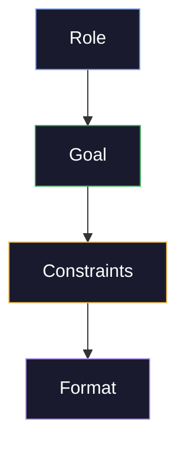

# Prompt Architecture: Structural Layering, XML, JSON Schemas, and Chain of Thought

A well-architected prompt is the single highest-leverage investment in getting consistent AI output. This note covers the 4-layer structural template (Role → Goal → Constraints → Format), the three modular formats (XML, JSON, paragraph), and how to choose among them. These patterns build on the axioms in [prompt-foundations](/16-AI-and-Prompts/Prompt-Engineering/prompt-foundations) and inform the model-specific strategies in [model-specific-prompting](/16-AI-and-Prompts/Prompt-Engineering/model-specific-prompting).

---

## Layering: Role, Goal, Constraints, Format

A well-architected prompt has four layers. Each layer serves a distinct purpose:



> [!abstract] The four layers
> - **Role** — who the model is (primes vocabulary and reasoning)
> - **Goal** — what to accomplish (the single most important sentence)
> - **Constraints** — boundaries and rules (what NOT to do)
> - **Format** — how to structure the output (JSON, table, bullet list)

### Layer 1: Role — Priming Vocabulary and Reasoning Patterns

The role primes the model's vocabulary, reasoning patterns, and assumptions. A "senior tax accountant" generates different output than a "financial journalist" — even given the same question.

#### Effective role definitions include

- **Expertise level:** "You are a senior data engineer with 10 years of experience in ETL pipelines"
- **Perspective:** "You think like a security auditor — assume everything is a potential attack vector"
- **Anti-role:** "You are NOT a salesperson. Do not pitch or upsell. Be honest about limitations."

#### Example of a strong role definition

```
You are a Lead Cloud DevOps and Site Reliability Engineer (SRE).
Your specialty is GCP serverless infrastructure, specifically
optimizing cost-to-performance ratios for Cloud Run and Cloud SQL.
Think like someone who has been paged at 3am and wants to prevent
it from happening again.
```

> [!tip] Anti-Roles Are Underused
> Telling the model who it is NOT can be more powerful than telling it who it is. "You are NOT a salesperson" shapes output more reliably than "be objective" — because it gives the model a concrete frame to reject.

### Layer 2: Goal — The Single Most Important Sentence

The goal is the **single most important sentence** in your prompt. If the model could only read one line, this should be it.

| Weak goal | Strong goal |
|-----------|-------------|
| "Help me with my Terraform" | "Refactor my Terraform config to use modules, extracting the VPC, IAM, and Cloud Run resources into separate reusable modules" |
| "Write tests" | "Write unit tests for the `compute_daily_scores` function covering: normal input, empty dataframe, missing columns, and NaN values" |
| "Analyze this data" | "Identify the top 3 anomalies in this time series data and explain what each one likely means in a financial context" |

> [!warning] Buried goals produce poor output
>
> If your goal is in paragraph 3, the model has already started pattern-matching against the opening words. Put the goal in the **first sentence** of the user prompt. See [intent vs. output misalignment](/16-AI-and-Prompts/Prompt-Engineering/prompt-debugging#42-intent-vs-output-misalignment) for the failure mode this prevents.

### Layer 3: Constraints — Defining the Negative Space

Constraints prevent the model from going off track. They are **negative space** — defining what NOT to do is often more important than what to do.

#### Categories of constraints

| Type | Example |
|------|---------|
| **Scope** | "Only address the authentication flow, not the entire backend" |
| **Depth** | "Keep explanations at a senior engineer level — skip basics" |
| **Length** | "Maximum 200 words" or "Exactly 5 bullet points" |
| **Tone** | "Technical and direct, not conversational" |
| **Exclusions** | "Do not suggest using a different framework" |
| **Accuracy** | "If you're not sure, say so — do not guess" |

> [!tip] Positive beats negative instructions
>
> "Maximum 3 sentences" is stronger than "don't be verbose." Specific metrics outperform adjectives. When you find yourself writing "don't be X," convert it to "do Y instead" wherever possible.

### Layer 4: Format — Eliminating Wasted Iterations

Explicit format instructions eliminate the most common source of wasted iterations — getting the right content in the wrong shape.

```
Output format:
- One markdown table with columns: Metric | Current | Target | Gap
- Below the table: 3 bullet points of recommended actions
- Each bullet: action verb + specific change + expected impact
- No introduction or conclusion
```

### Complete Example: All 4 Layers Together

```
Role: You are a senior financial analyst specializing in European
equity indices.

Goal: Analyze the attached market index Q3 earnings data and identify
the 5 stocks with the strongest momentum-value divergence.

Constraints:
- Use only the data provided — do not reference external sources
- Define "momentum" as 30-day RSI + 50/200 MA crossover
- Define "value" as forward P/E z-score within sector
- Divergence = momentum rank and value rank differ by >20 positions
- Ignore stocks with market cap below EUR 10B

Format:
- Markdown table: Rank | Symbol | Name | Momentum Score | Value Score
  | Rank Divergence | Interpretation
- Below: 2-sentence summary of the overall pattern
```

---

## Modular Structures: XML, JSON, Schemas, Paragraphs

Different structural formats serve different purposes. The choice of format affects how precisely the model interprets your intent.

### XML Tags: Unambiguous Section Boundaries

XML tags create **unambiguous boundaries** between sections. Models (especially Claude) treat XML tags as strong structural delimiters. Content inside tags is parsed as a distinct unit.

```xml
<role>
You are a Python code reviewer focused on data pipeline reliability.
</role>

<task>
Review the following function for:
1. Idempotency issues
2. Error handling gaps
3. Performance bottlenecks with large datasets (>1M rows)
</task>

<code>
def load_ohlcv(conn, df, table_name):
    ...
</code>

<output_format>
For each issue found:
- Line number
- Issue category (idempotency | error handling | performance)
- Current behavior
- Recommended fix (code snippet)
</output_format>

<constraints>
- Do not suggest style changes
- Do not add type annotations
- Only flag issues that could cause data loss or silent failures
</constraints>
```

**When to use XML:** Complex prompts with 3+ distinct sections, system prompts, agent instructions, multi-step workflows. Claude specifically interprets XML tags as structural markers (see [Claude-specific guidance](/16-AI-and-Prompts/Prompt-Engineering/model-specific-prompting#claude-anthropic)).

> [!warning] LLM JSON syntax errors
>
> Models occasionally produce invalid JSON -- trailing commas, unescaped quotes, missing brackets, or markdown code fence wrappers around the JSON. Always wrap `json.loads()` in a try/except and implement a retry-with-repair strategy. Adding "Return ONLY valid JSON, no markdown formatting" to the prompt reduces but does not eliminate this issue. For production pipelines, use the model's structured output mode (Anthropic's tool_use, OpenAI's JSON mode) instead of parsing free-text JSON.

### JSON Schema: Machine-Readable Structured Output

JSON is ideal when you need the model to produce **machine-readable structured output** that will be parsed by code.

```
Extract the following information from the earnings call transcript.
Return ONLY valid JSON matching this schema:

{
  "company": "string",
  "quarter": "string (e.g. Q3 2025)",
  "revenue_growth_yoy": "number (percentage, e.g. 12.5)",
  "guidance_direction": "raised | maintained | lowered | not_provided",
  "key_risks": ["string", "string"],
  "sentiment": "bullish | neutral | bearish"
}

If a field cannot be determined from the transcript, use null.
Do not add fields not in the schema. Do not wrap in markdown code blocks.
```

**When to use JSON:** API integrations, data extraction, structured outputs that feed into downstream processing.

### Paragraph Form: Nuanced and Conversational Tasks

Free-form paragraphs work best for creative, conversational, or nuanced tasks where rigid structure would feel forced.

```
I'm designing a data pipeline that processes stock market data from
three indices (Euro market index, the data pipeline project Asia/Pacific 50, the data pipeline project USA 50).
The pipeline runs three times daily after each market close.

My concern is handling overlapping exchange hours — when the US market
opens, Asian markets have already closed, but their pulse data might
still be updating for Hong Kong stocks that trade on multiple exchanges.

Walk me through how you'd handle the timing logic. I'm using Python
with pyodbc and SQL Server. The pipeline is orchestrated by Airflow
with three DAGs. I want the solution to be simple — I'd rather have
a slightly delayed update than complex timezone-aware scheduling.
```

**When to use paragraphs:** Brainstorming, explaining a problem to get advice, creative writing, situations where the model needs to understand nuance and context rather than follow a rigid template.

### Format Comparison Table

| Format | Precision | Readability | Best for |
|--------|-----------|-------------|----------|
| XML tags | High | Medium | System prompts, agents, complex tasks |
| JSON schema | Highest | Low | Structured extraction, API output |
| Markdown sections | Medium-High | High | Documentation, multi-part tasks |
| Numbered lists | Medium | High | Step-by-step procedures |
| Plain paragraphs | Low | Highest | Creative, conversational, exploratory |

> [!info] Format and Model Interaction
> The right format also depends on the model. Claude handles XML best. GPT-4 handles markdown system/user separation well. Gemini works well with clearly-framed task statements. See [model-specific-prompting](/16-AI-and-Prompts/Prompt-Engineering/model-specific-prompting) for per-model format guidance.

---

## Meta-Prompting and Chain of Thought

### Chain of Thought Prompting

Chain of thought (CoT) prompting forces the model to externalize its reasoning before reaching a conclusion. This dramatically improves accuracy on multi-step problems.

#### Basic CoT trigger phrases
- "Think step by step"
- "Before answering, work through the logic:"
- "Walk me through your reasoning"

#### Structured CoT (numbered stages)

```
Analyze whether Company X should enter the Japanese market.

Think through this step by step:
1. Market size and growth trajectory
2. Competitive landscape (existing players, barriers to entry)
3. Regulatory environment
4. Company X's current capabilities vs. market requirements
5. Financial projection (best case, worst case, expected)
6. Final recommendation with confidence level
```

> [!tip] CoT for Debugging
> Chain of thought is especially useful when debugging code or data issues. Ask the model to "trace through the execution step by step" before proposing a fix. This surfaces assumptions the model is making and often catches errors in its own reasoning.

### Meta-Prompting: Using AI to Improve Prompts

Meta-prompting is using the model itself to analyze and improve your prompts. It is one of the fastest ways to identify structural weaknesses.

#### Key meta-prompt patterns

#### Before answering, identify 3 possible interpretations of this question
```
Before answering, identify 3 possible interpretations of this question,
then state which interpretation you're using and why.
Question: [your question]
```

**What's wrong with this prompt?**
```
Analyze this prompt and identify its weaknesses:
[paste your prompt]
Focus on: ambiguity, missing constraints, format gaps, and intent misalignment.
```

#### Generate a better version
```
Here is a prompt I'm using: [paste prompt]
Here is the output it produced: [paste output]
Here is what I actually wanted: [describe ideal output]
Rewrite the prompt to produce the desired output.
```

> [!warning] Meta-Prompting Limitations
> The model evaluating its own prompt inherits its own blind spots. Use a different role for evaluation than for generation — if the generator was a "data engineer," make the evaluator a "prompt engineer" or "technical writer." See [evaluation agent pattern](/16-AI-and-Prompts/Prompt-Engineering/prompt-debugging#51-workflows-loops-and-multi-agent-systems) for the architectural solution.

---

### Quick Reference: The 4-Layer Prompt Template

```
Role: [Who the model is — expertise, perspective, anti-role]

Task: [One clear sentence — what to accomplish]

Constraints:
- [Scope boundary]
- [Depth/length limit]
- [What NOT to do]
- [Uncertainty handling]

Format:
- [Output structure — table, list, JSON, paragraphs]
- [Length — words, sentences, items]
- [Example if complex]
```

---

## Related Notes

- [prompt-foundations](/16-AI-and-Prompts/Prompt-Engineering/prompt-foundations) — The three axioms and context hierarchy that underlie these architectural patterns
- [model-specific-prompting](/16-AI-and-Prompts/Prompt-Engineering/model-specific-prompting) — Claude vs. GPT-4 vs. Gemini vs. Grok format preferences
- [applied-prompting](/16-AI-and-Prompts/Prompt-Engineering/applied-prompting) — The 4-layer template applied to research, code, data extraction, and content tasks
- [prompt-debugging](/16-AI-and-Prompts/Prompt-Engineering/prompt-debugging) — Rebuilding broken prompts using phrasing, logic steps, and reinforcement

## References

- [Anthropic Claude Prompt Engineering](https://docs.anthropic.com/en/docs/build-with-claude/prompt-engineering/overview)
- [OpenAI Best Practices](https://platform.openai.com/docs/guides/prompt-engineering)
