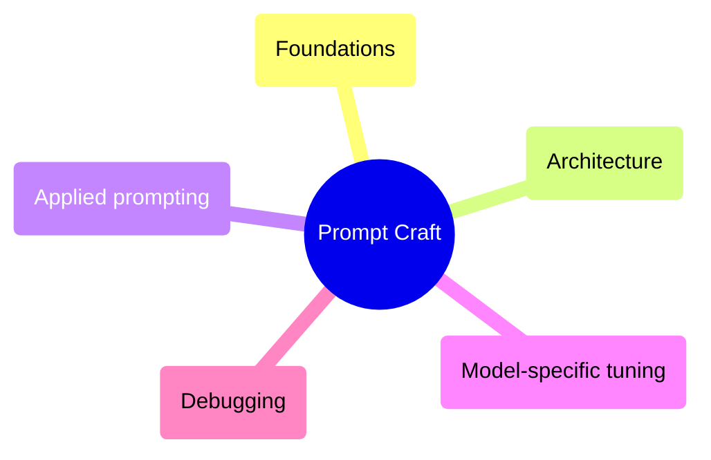
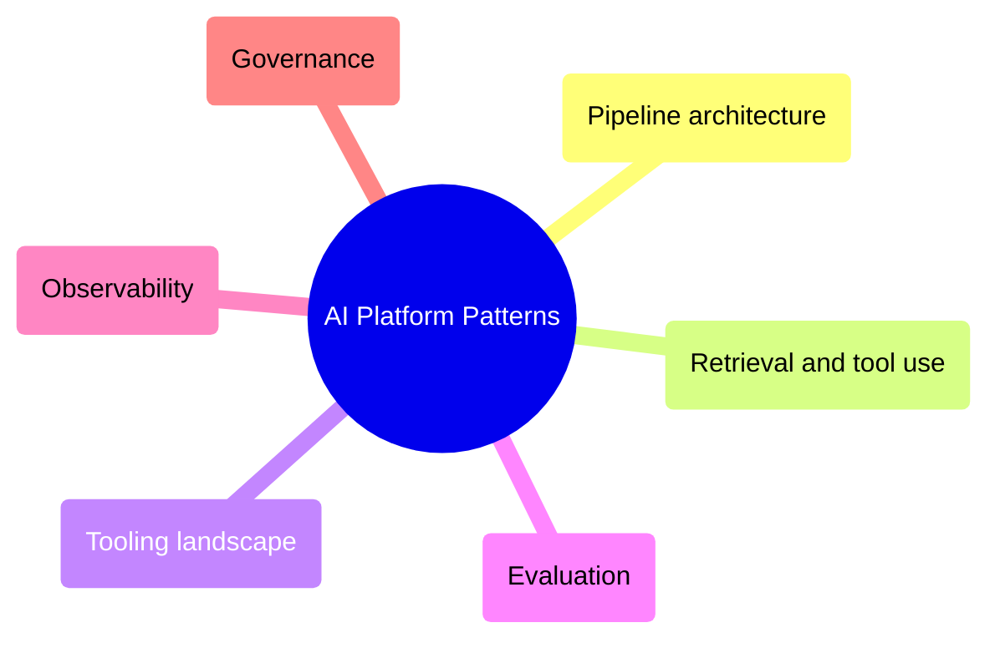
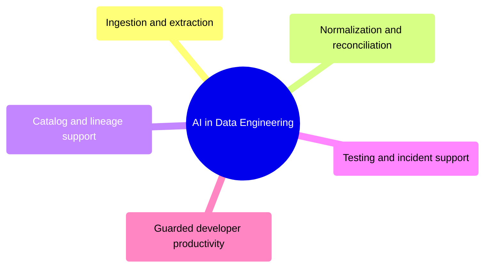
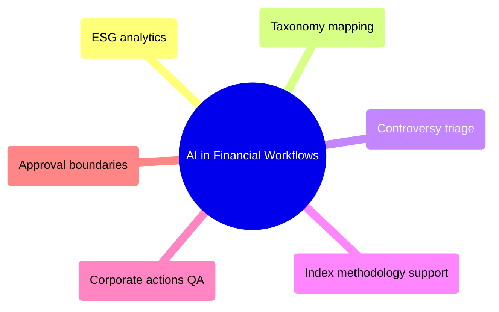

# MOC: AI & Prompts

This chapter is organized around the jobs engineers and analysts actually need to do with AI in production: design prompts that behave consistently, build LLM pipelines that stay observable and governable, decide where AI belongs in data engineering, and apply it safely in ESG and index workflows.

> [!guide]+ Prompt Craft
>
> [[domain-prompt-craft]]
>
> Prompt fundamentals, prompt architecture, applied prompting, model-specific tuning, and systematic prompt debugging.

> [!guide]+ AI Platform Patterns
>
> [[domain-ai-platform-patterns]]
>
> LLM pipeline architecture, retrieval and tool use, current tooling categories, evaluation, observability, and operational guardrails.

> [!guide]+ AI in Data Engineering
>
> [[domain-ai-in-data-engineering]]
>
> Where AI helps across ingestion, extraction, reconciliation, cataloging, incident support, documentation, and developer productivity in production data platforms.

> [!guide]+ AI in Financial Workflows
>
> [[domain-ai-in-financial-workflows]]
>
> ESG document intelligence, issuer-level enrichment, methodology interpretation, index maintenance support, and governance boundaries for regulated operations.

## Cross-References

- [[moc-data-architecture]] for idempotent pipelines, data contracts, retries, and validation patterns that AI layers must inherit rather than bypass.
- [[moc-observability]] for tracing, incident response, auditability, and alerting patterns extended here to AI-specific telemetry.
- [[moc-dataops]] for release discipline, rollback criteria, and approval workflows that constrain model changes in production.
- [[moc-gcp]] for service boundaries, secret management, cost control, and deployment patterns relevant to hosted AI systems.
- [[moc-github-actions]] for regression testing, CI enforcement, and review automation around prompts, eval suites, and model configurations.
- [[moc-financial-domain]] for the benchmark, ESG, and index context that makes these AI patterns operationally meaningful rather than generic.
