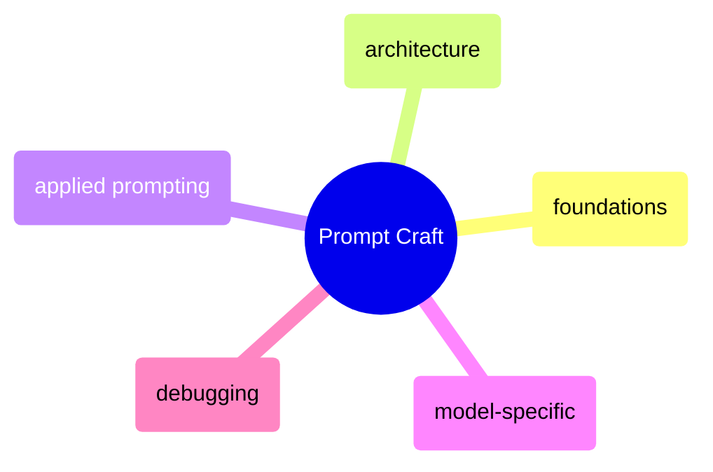
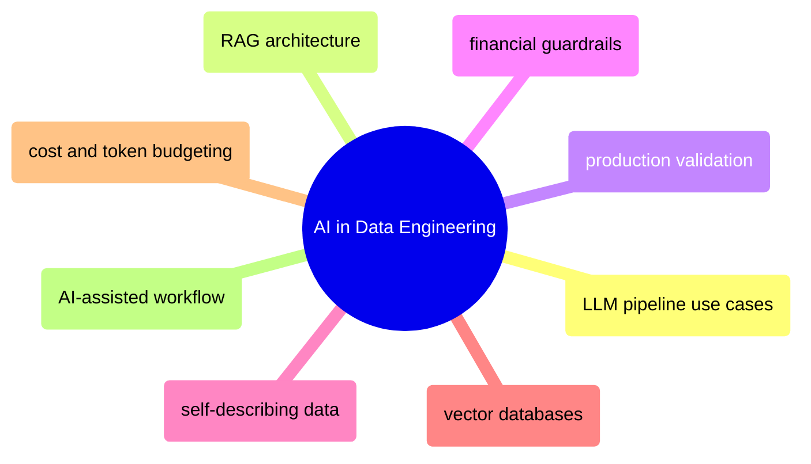

# MOC: AI & Prompts

Prompt engineering and LLM integration for data engineering — from
foundational prompting techniques through production validation to
AI-augmented pipeline architecture. Expand any section to browse
page contents and jump to specific topics.

> [!example]- Prompt Craft
>
> > [!abstract]- [[prompt-foundations]]
> >
> > - [[prompt-foundations#Core Principles of Prompt Engineering|Core principles and three axioms]]
> > - [[prompt-foundations#Context Hierarchy and Priority Levels|Context hierarchy and priority levels]]
> > - [[prompt-foundations#Clarity, Specificity, and Intent Alignment|Clarity, specificity, and intent alignment]]
> > - [[prompt-foundations#How Structure Affects Reasoning, Creativity, and Factuality|Structure by task type]]
>
> > [!abstract]- [[prompt-architecture]]
> >
> > - [[prompt-architecture#Layering: Role, Goal, Constraints, Format|The 4-layer template]]
> > - [[prompt-architecture#Modular Structures: XML, JSON, Schemas, Paragraphs|XML, JSON, and paragraph formats]]
> > - [[prompt-architecture#Chain of Thought Prompting|Chain of thought prompting]]
> > - [[prompt-architecture#Meta-Prompting: Using AI to Improve Prompts|Meta-prompting]]
>
> > [!abstract]- [[applied-prompting]]
> >
> > - [[applied-prompting#Research and Analysis|Research and analysis prompts]]
> > - [[applied-prompting#Content Creation|Content creation prompts]]
> > - [[applied-prompting#Code and Technical Tasks|Code and technical prompts]]
> > - [[applied-prompting#Data Analysis and Extraction|Data extraction prompts]]
> > - [[applied-prompting|Before and after optimization]]
>
> > [!abstract]- [[model-specific-prompting]]
> >
> > - [[model-specific-prompting#Claude (Anthropic)|Claude prompting strategies]]
> > - [[model-specific-prompting|GPT-4 prompting strategies]]
> > - [[model-specific-prompting#Gemini (Google)|Gemini prompting strategies]]
> > - [[model-specific-prompting#Grok (xAI)|Grok prompting strategies]]
> > - [[model-specific-prompting#Cross-Model Portability Tips|Cross-model portability]]
> > - [[model-specific-prompting#Model Selection Decision Tree|Model selection decision tree]]
>
> > [!abstract]- [[prompt-debugging]]
> >
> > - [[prompt-debugging#Diagnosing Weak Outputs|Diagnosing weak outputs]]
> > - [[prompt-debugging#Intent vs. Output Misalignment|Intent vs output misalignment]]
> > - [[prompt-debugging#Rebuilding Prompts: Phrasing, Logic Steps, Reinforcement|Rebuilding prompts]]
> > - [[prompt-debugging#Workflows, Loops, and Multi-Agent Systems|Workflows and multi-agent systems]]
> > - [[prompt-debugging#Memory Layering and Iterative Refinement|Memory layering]]
> > - [[prompt-debugging#Building a Prompt Library|Building a prompt library]]

> [!example]- AI in Data Engineering
>
> > [!abstract]- [[ai-augmented-data-engineering]]
> >
> > - [[ai-augmented-data-engineering#Where LLMs Fit in Data Engineering|Where LLMs fit in data engineering]]
> > - [[ai-augmented-data-engineering#RAG Architecture: Retrieval-Augmented Generation|RAG architecture]]
> > - [[ai-augmented-data-engineering#Using LLMs in Data Pipelines|LLMs in data pipelines]]
> > - [[ai-augmented-data-engineering#Validating LLM Outputs in Production|Validating LLM outputs]]
> > - [[ai-augmented-data-engineering#Guardrails for Financial Data Pipelines|Financial pipeline guardrails]]
> > - [[ai-augmented-data-engineering#Self-Describing Data for AI Consumers|Self-describing data for AI]]
> > - [[ai-augmented-data-engineering#Vector Database Comparison for Financial Data|Vector database comparison]]
> > - [[ai-augmented-data-engineering#Cost Management and Token Budgeting|Cost management and token budgeting]]
> > - [[ai-augmented-data-engineering#Apache Iceberg + AI Hybrid Architecture|Iceberg and AI hybrid architecture]]
> > - [[ai-augmented-data-engineering#AI-Assisted Workflow: Senior Productivity with Claude Code and GitHub Copilot|AI-assisted development workflow]]

## Cross-References

- [[functional-pipeline-architecture|Functional Pipeline Architecture]] — The architecture that produces context-enriched, self-describing data for AI consumers
- [[data-quality-framework|Data Quality Framework]] — Quarantine pattern applied to failed LLM extractions
- [[moc-programming-languages|Programming Languages]] — Python foundations for LLM API integration
- [[moc-data-architecture|Data Architecture]] — Contract and provenance patterns extended to LLM outputs
