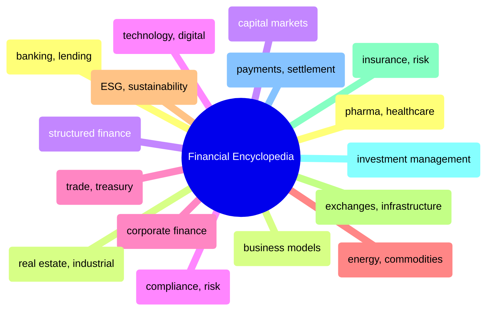

# Financial Encyclopedia

Sector-by-sector encyclopedia of financial industry concepts — banking, capital markets, corporate finance, ESG, insurance, payments, and more.

> [!abstract]- [[01-banking-and-lending]]

> [!abstract]- [[02-business-models-and-commerce]]

> [!abstract]- [[03-capital-markets-and-trading]]

> [!abstract]- [[04-compliance-and-risk-management]]

> [!abstract]- [[05-corporate-finance-and-strategy]]

> [!abstract]- [[06-energy-and-commodities]]

> [!abstract]- [[07-esg-and-sustainability]]

> [!abstract]- [[08-exchanges-and-market-infrastructure]]

> [!abstract]- [[09-insurance-and-risk]]

> [!abstract]- [[10-investment-management]]

> [!abstract]- [[11-payments-and-settlement]]

> [!abstract]- [[12-pharma-and-healthcare]]

> [!abstract]- [[13-real-estate-and-industrial]]

> [!abstract]- [[14-structured-finance]]

> [!abstract]- [[15-technology-and-digital]]

> [!abstract]- [[16-trade-and-treasury]]
