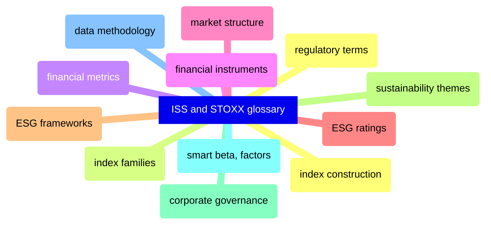

# ISS-STOXX Glossary

Comprehensive glossary of ISS-STOXX terminology — index construction, index families, financial metrics, ESG ratings, sustainability themes, corporate governance, and smart beta factors.

> [!abstract]- [[02-index-construction]]

> [!abstract]- [[01-index-families]]

> [!abstract]- [[10-financial-metrics]]

> [!abstract]- [[09-financial-instruments]]

> [!abstract]- [[11-market-structure]]

> [!abstract]- [[05-esg-ratings]]

> [!abstract]- [[06-esg-terms]]

> [!abstract]- [[04-esg-frameworks]]

> [!abstract]- [[07-sustainability-themes]]

> [!abstract]- [[08-corporate-governance]]

> [!abstract]- [[03-smart-beta-factors]]

> [!abstract]- [[13-data-methodology]]

> [!abstract]- [[12-regulatory|Regulatory terms]]
