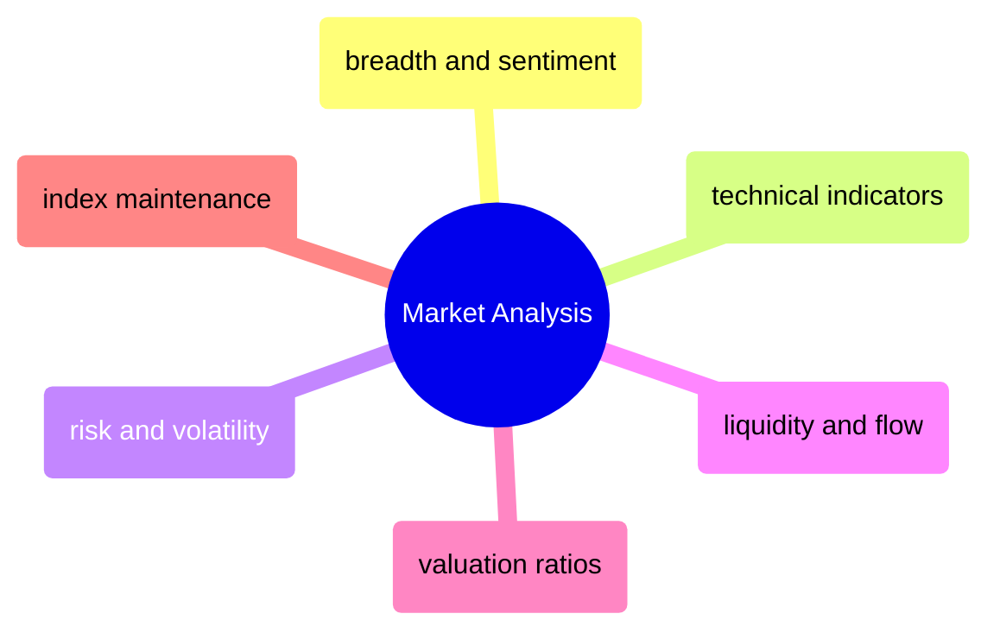

# Market Analysis

Quantitative market analysis — breadth indicators, technical signals, risk metrics, liquidity measures, valuation ratios, and index maintenance operations.

> [!abstract]- [[05-breadth-and-sentiment-indicators]]
>
> - [[breadth-and-sentiment-indicators#Breadth and Sentiment Metrics|Breadth and sentiment metrics]]
> - [[breadth-and-sentiment-indicators#Percent Above 200-Day Moving Average|Percent above 200-day MA]]
> - [[breadth-and-sentiment-indicators#New Highs Minus New Lows|New highs minus new lows]]
> - [[breadth-and-sentiment-indicators#Short Interest Ratio|Short interest ratio]]

> [!abstract]- [[01-technical-indicators]]
>
> - [[technical-indicators#Momentum and Trend Indicators|Momentum and trend indicators]]
> - [[technical-indicators#RSI (Relative Strength Index)|RSI]]
> - [[technical-indicators#MACD (Moving Average Convergence Divergence)|MACD]]
> - [[technical-indicators#ADX (Average Directional Index)|ADX]]

> [!abstract]- [[03-risk-and-volatility-metrics]]
>
> - [[risk-and-volatility-metrics#Beta|Beta]]
> - [[risk-and-volatility-metrics#VIX (CBOE Volatility Index)|VIX]]
> - [[risk-and-volatility-metrics#Maximum Drawdown|Maximum drawdown]]
> - [[risk-and-volatility-metrics#Sortino Ratio|Sortino ratio]]
> - [[risk-and-volatility-metrics#Value at Risk (VaR)|Value at Risk]]

> [!abstract]- [[04-liquidity-and-flow-metrics]]
>
> - [[liquidity-and-flow-metrics#Bid-Ask Spread|Bid-ask spread]]
> - [[liquidity-and-flow-metrics#Turnover Ratio|Turnover ratio]]
> - [[liquidity-and-flow-metrics#Money Flow Index (MFI)|Money Flow Index]]
> - [[liquidity-and-flow-metrics#On-Balance Volume (OBV)|On-Balance Volume]]

> [!abstract]- [[02-valuation-ratios]]
>
> - [[valuation-ratios#Core Valuation Ratios|Core valuation ratios]]
> - [[valuation-ratios#PEG Ratio|PEG ratio]]
> - [[valuation-ratios#Earnings Yield|Earnings yield]]
> - [[valuation-ratios#Free Cash Flow Yield|Free cash flow yield]]

> [!abstract]- [[06-index-maintenance-and-corporate-actions]]
>
> - [[index-maintenance-and-corporate-actions#What Is a Financial Index?|What is a financial index]]
> - [[index-maintenance-and-corporate-actions#Corporate Actions: The Highest-Risk Data Operation|Corporate actions]]
> - [[index-maintenance-and-corporate-actions#Index Reconstitution: The Quarterly Event|Index reconstitution]]
> - [[index-maintenance-and-corporate-actions#Free-Float Methodology|Free-float methodology]]
> - [[index-maintenance-and-corporate-actions#Weight Capping and Rebalancing|Weight capping and rebalancing]]
> - [[index-maintenance-and-corporate-actions#Point-in-Time (PIT) Temporal Data: Querying History Without Look-Ahead Bias|Point-in-time temporal data]]

> [!abstract]- [[07-corporate-action-missed]]
>
> - [[corporate-action-missed#Immediate Containment|Immediate containment]]
> - [[corporate-action-missed#Correction Workflow|Correction workflow]]
> - [[corporate-action-missed#Publication and Audit Trail|Publication and audit trail]]
