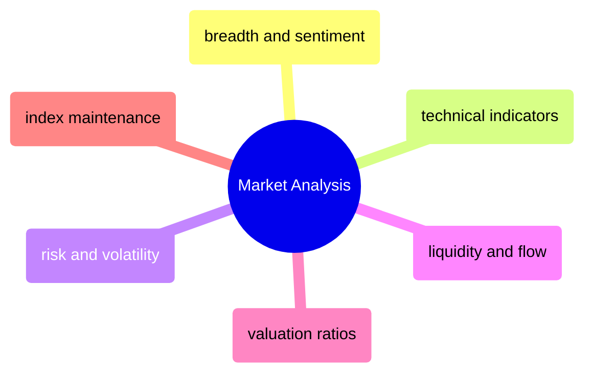

# Market Analysis

Quantitative market analysis — breadth indicators, technical signals, risk metrics, liquidity measures, valuation ratios, and index maintenance operations.

> [!abstract]- [[05-breadth-and-sentiment-indicators]]

> [!abstract]- [[01-technical-indicators]]

> [!abstract]- [[03-risk-and-volatility-metrics]]

> [!abstract]- [[04-liquidity-and-flow-metrics]]

> [!abstract]- [[02-valuation-ratios]]

> [!abstract]- [[06-index-maintenance-and-corporate-actions]]

> [!abstract]- [[07-corporate-action-missed]]
