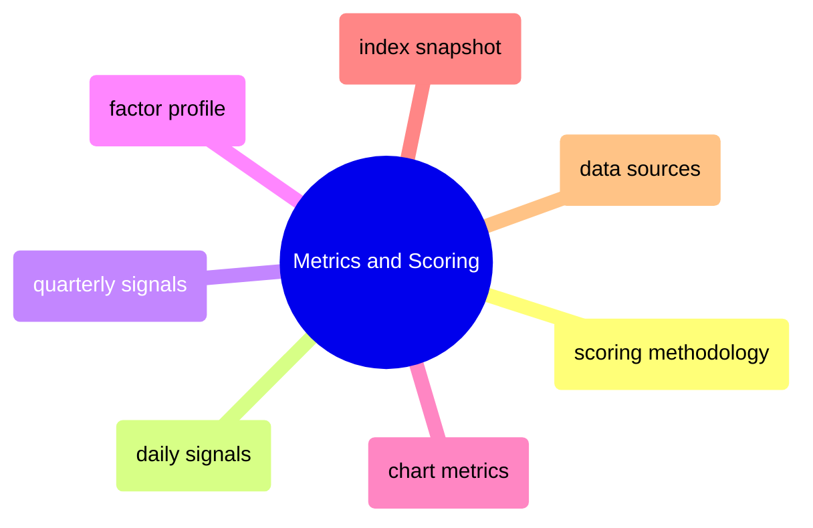

# Metrics and Scoring

Scoring methodologies, daily and quarterly signal generation, factor profiles, chart metrics, index snapshots, and data source refresh schedules.

> [!abstract]- [[01-scoring-methodology]]
>
> - [[scoring-methodology#Z-Score Calculation|Z-score calculation]]
> - [[scoring-methodology#Composite Scores|Composite scores]]
> - [[scoring-methodology#Ranking|Ranking]]
> - [[scoring-methodology#Index Weights (Cap-Weighting)|Index weights]]
> - [[scoring-methodology#Sector-Level vs Index-Level Grouping|Sector vs index grouping]]

> [!abstract]- [[03-daily-signal-scores]]
>
> - [[daily-signal-scores#Momentum Score|Momentum score]]
> - [[daily-signal-scores#Divergence Alerts|Divergence alerts]]
> - [[daily-signal-scores#Relative Value Score|Relative value score]]
> - [[daily-signal-scores#Sentiment Score|Sentiment score]]

> [!abstract]- [[04-quarterly-signal-scores]]
>
> - [[quarterly-signal-scores#Health Warnings|Health warnings]]
> - [[quarterly-signal-scores#Governance Risk Score|Governance risk score]]

> [!abstract]- [[02-factor-profile-and-composition]]
>
> - [[factor-profile-and-composition#Factor Profile (Radar Chart)|Factor profile]]
> - [[factor-profile-and-composition#Index Composition (Donut Chart)|Index composition]]

> [!abstract]- [[06-chart-metrics]]
>
> - [[chart-metrics#Synthetic Portfolio Return (%)|Synthetic portfolio return]]
> - [[chart-metrics#Rolling 30d Return (%)|Rolling 30-day return]]
> - [[chart-metrics#Drawdown from Peak (%)|Drawdown from peak]]
> - [[chart-metrics#Annualized Volatility (%)|Annualized volatility]]
> - [[chart-metrics#Rolling 30d Sharpe Ratio|Rolling 30-day Sharpe ratio]]

> [!abstract]- [[05-index-snapshot-metrics]]
>
> - [[index-snapshot-metrics#Index Snapshot Metrics Table|Index snapshot metrics table]]
> - [[index-snapshot-metrics#vs 90d Return Interpretation|90-day return interpretation]]
> - [[index-snapshot-metrics#Cap-Weighting Formula|Cap-weighting formula]]

> [!abstract]- [[07-data-sources-and-refresh]]
>
> - [[data-sources-and-refresh#Data Sources|Data sources]]
> - [[data-sources-and-refresh#Pipeline Schedule|Pipeline schedule]]
> - [[data-sources-and-refresh#Data Flow|Data flow]]
> - [[data-sources-and-refresh#Refresh Impact on Scoring|Refresh impact on scoring]]

> [!abstract]- [[08-vendor-file-late-or-missing]]
>
> - [[vendor-file-late-or-missing#Detection and Triage|Detection and triage]]
> - [[vendor-file-late-or-missing#Fallback Rules|Fallback rules]]
> - [[vendor-file-late-or-missing#Recovery and Reconciliation|Recovery and reconciliation]]
