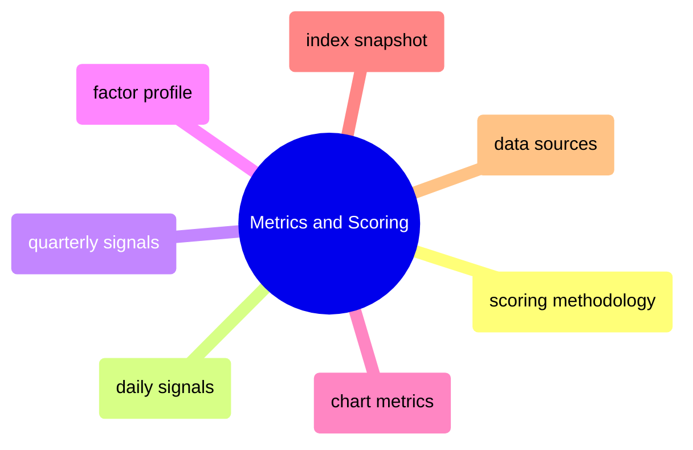

# Metrics and Scoring

Scoring methodologies, daily and quarterly signal generation, factor profiles, chart metrics, index snapshots, and data source refresh schedules.

> [!abstract]- [[01-scoring-methodology]]

> [!abstract]- [[03-daily-signal-scores]]

> [!abstract]- [[04-quarterly-signal-scores]]

> [!abstract]- [[02-factor-profile-and-composition]]

> [!abstract]- [[06-chart-metrics]]

> [!abstract]- [[05-index-snapshot-metrics]]

> [!abstract]- [[07-data-sources-and-refresh]]

> [!abstract]- [[08-vendor-file-late-or-missing]]
