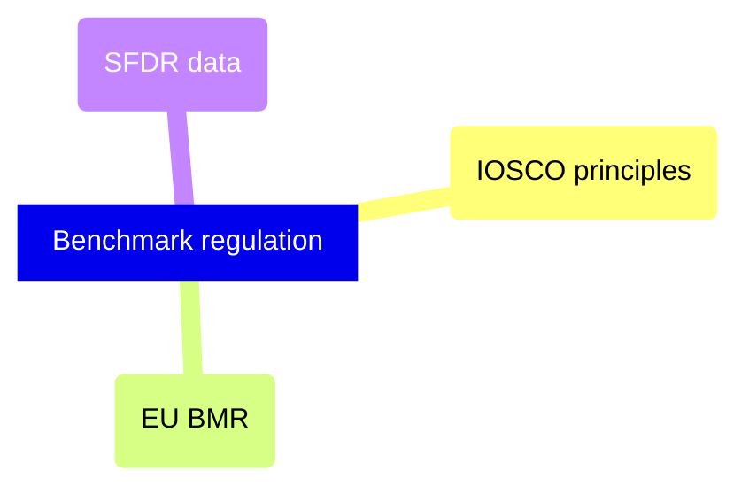

# Regulatory

Financial benchmark regulation — IOSCO principles, EU BMR administrator obligations, and SFDR sustainability disclosure data requirements.

> [!abstract]- [[02-iosco-benchmark-principles]]

> [!abstract]- [[01-eu-bmr-benchmark-regulation]]

> [!abstract]- [[03-sfdr-data-requirements]]

> [!abstract]- [[04-esg-circuit-breaker-fired]]
