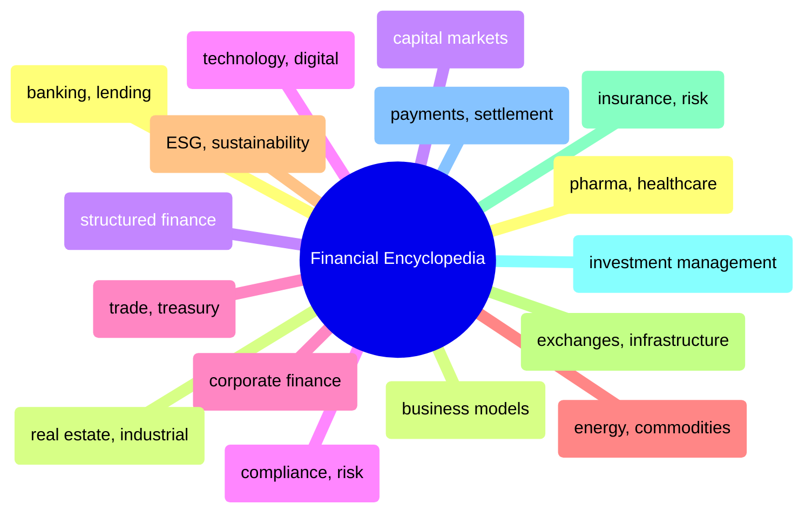

# Financial Encyclopedia

Sector-by-sector encyclopedia of financial industry concepts — banking, capital markets, corporate finance, ESG, insurance, payments, and more.

> [!abstract]- [[banking-and-lending]]
>
> - [[banking-and-lending#Bancassurance|Bancassurance]]
> - [[banking-and-lending#Commercial Banking|Commercial banking]]
> - [[banking-and-lending#Consumer Finance|Consumer finance]]
> - [[banking-and-lending#Retail Banking|Retail banking]]

> [!abstract]- [[business-models-and-commerce]]
>
> - [[business-models-and-commerce#Business-to-Business (B2B)|Business-to-Business]]
> - [[business-models-and-commerce#E-Commerce|E-Commerce]]
> - [[business-models-and-commerce#Platform Business Model|Platform business model]]
> - [[business-models-and-commerce#Subscription Model|Subscription model]]

> [!abstract]- [[capital-markets-and-trading]]
>
> - [[capital-markets-and-trading#Capital Markets|Capital markets]]
> - [[capital-markets-and-trading#Derivatives|Derivatives]]
> - [[capital-markets-and-trading#Equities|Equities]]
> - [[capital-markets-and-trading#Initial Public Offering (IPO)|IPO]]

> [!abstract]- [[compliance-and-risk-management]]
>
> - [[compliance-and-risk-management#Compliance|Compliance]]
> - [[compliance-and-risk-management#Intellectual Property (IP)|Intellectual property]]
> - [[compliance-and-risk-management#Risk Management|Risk management]]
> - [[compliance-and-risk-management#Regulatory Approval|Regulatory approval]]

> [!abstract]- [[corporate-finance-and-strategy]]
>
> - [[corporate-finance-and-strategy#Corporate Finance Advisory|Corporate finance advisory]]
> - [[corporate-finance-and-strategy#Mergers and Acquisitions (M&A)|Mergers and acquisitions]]
> - [[corporate-finance-and-strategy#Spin-Off|Spin-off]]
> - [[corporate-finance-and-strategy#Restructuring|Restructuring]]

> [!abstract]- [[energy-and-commodities]]
>
> - [[energy-and-commodities#Carbon Capture and Storage|Carbon capture and storage]]
> - [[energy-and-commodities#Commodity Trading|Commodity trading]]
> - [[energy-and-commodities#Renewable Energy|Renewable energy]]
> - [[energy-and-commodities#Upstream|Upstream]]

> [!abstract]- [[esg-and-sustainability]]
>
> - [[esg-and-sustainability#ESG (Environmental, Social, and Governance)|ESG overview]]
> - [[esg-and-sustainability#Net-Zero|Net-zero]]
> - [[esg-and-sustainability#Sustainable Finance|Sustainable finance]]

> [!abstract]- [[exchanges-and-market-infrastructure]]
>
> - [[exchanges-and-market-infrastructure#Clearing|Clearing]]
> - [[exchanges-and-market-infrastructure#Custodian Services|Custodian services]]
> - [[exchanges-and-market-infrastructure#Listing|Exchange and listing]]
> - [[exchanges-and-market-infrastructure#Settlement|Settlement]]

> [!abstract]- [[insurance-and-risk]]
>
> - [[insurance-and-risk#Annuity|Annuity]]
> - [[insurance-and-risk#Insurance (Life)|Insurance (life)]]
> - [[insurance-and-risk#Reinsurance|Reinsurance]]
> - [[insurance-and-risk#Parametric Insurance|Parametric insurance]]

> [!abstract]- [[investment-management]]
>
> - [[investment-management#Asset Management|Asset management]]
> - [[investment-management#Hedge Funds|Hedge funds]]
> - [[investment-management#Private Equity|Private equity]]
> - [[investment-management#Wealth Management|Wealth management]]

> [!abstract]- [[payments-and-settlement]]
>
> - [[payments-and-settlement#Acquiring (Payments)|Acquiring]]
> - [[payments-and-settlement#Payments Processing|Payments processing]]
> - [[payments-and-settlement#Settlement|Settlement]]
> - [[payments-and-settlement#Tokenization|Tokenization]]

> [!abstract]- [[pharma-and-healthcare]]
>
> - [[pharma-and-healthcare#Biosimilars|Biosimilars]]
> - [[pharma-and-healthcare#Clinical Trials|Clinical trials]]
> - [[pharma-and-healthcare#FDA Approval|FDA approval]]
> - [[pharma-and-healthcare#Medical Devices|Medical devices]]

> [!abstract]- [[real-estate-and-industrial]]
>
> - [[real-estate-and-industrial#Real Estate Investment|Real estate investment]]
> - [[real-estate-and-industrial#Logistics|Logistics]]
> - [[real-estate-and-industrial#OEM (Original Equipment Manufacturer)|OEM]]
> - [[real-estate-and-industrial#Supply Chain|Supply chain]]

> [!abstract]- [[structured-finance]]
>
> - [[structured-finance#Securitization|Securitization]]
> - [[structured-finance#Project Finance|Project finance]]
> - [[structured-finance#Loan Syndication|Loan syndication]]
> - [[structured-finance#Trade Finance|Trade finance]]

> [!abstract]- [[technology-and-digital]]
>
> - [[technology-and-digital#Cloud Computing|Cloud computing]]
> - [[technology-and-digital#Cybersecurity|Cybersecurity]]
> - [[technology-and-digital#Fintech|Fintech]]
> - [[technology-and-digital#SaaS (Software as a Service)|SaaS]]

> [!abstract]- [[trade-and-treasury]]
>
> - [[trade-and-treasury#Cash Management|Cash management]]
> - [[trade-and-treasury#Trade Finance|Trade finance]]
> - [[trade-and-treasury#Treasury Services|Treasury services]]
> - [[trade-and-treasury#Working Capital|Working capital]]
