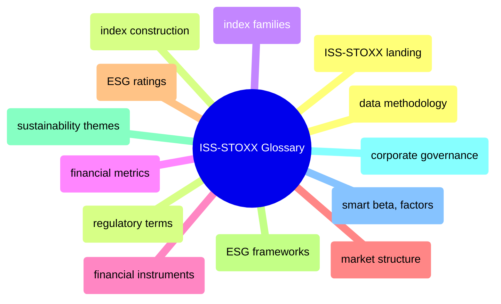

# ISS-STOXX Glossary

Comprehensive glossary of ISS-STOXX terminology — index construction, index families, financial metrics, ESG ratings, sustainability themes, corporate governance, and smart beta factors.

> [!abstract]- [[ISS-STOXX/_index|ISS-STOXX]]
>
> - [[ISS-STOXX/_index#Domains|Domains]]
> - [[ISS-STOXX/_index#How to Use This Glossary|How to use this glossary]]
> - [[ISS-STOXX/_index#Related Vault Sections|Related vault sections]]

> [!abstract]- [[index-construction]]
>
> - [[index-construction#B|Weighting and rebalancing (B)]]
> - [[index-construction#C|Capping and calculation (C)]]
> - [[index-construction#F|Free-float and filters (F)]]
> - [[index-construction#S|Selection and screening (S)]]

> [!abstract]- [[index-families]]
>
> - [[index-families#D|DAX family (D)]]
> - [[index-families#E|EURO STOXX family (E)]]
> - [[index-families#S|STOXX family (S)]]
> - [[index-families#Additional Index Families|Additional index families]]

> [!abstract]- [[financial-metrics]]
>
> - [[financial-metrics#D|Dividend and debt metrics (D)]]
> - [[financial-metrics#R|Return and risk metrics (R)]]
> - [[financial-metrics#V|Volatility and valuation (V)]]

> [!abstract]- [[financial-instruments]]
>
> - [[financial-instruments#D|Derivatives (D)]]
> - [[financial-instruments#I|Index-linked instruments (I)]]
> - [[financial-instruments#S|Structured products (S)]]
> - [[financial-instruments#Quick Reference — Instrument Categories|Instrument categories]]

> [!abstract]- [[market-structure]]
>
> - [[market-structure#C|Classification systems (C)]]
> - [[market-structure#L|Liquidity and listing (L)]]
> - [[market-structure#S|Sectors and exchanges (S)]]

> [!abstract]- [[esg-ratings]]
>
> - [[esg-ratings#C|Controversy and carbon scores (C)]]
> - [[esg-ratings#E|ESG risk ratings (E)]]
> - [[esg-ratings#K|Key performance indicators (K)]]

> [!abstract]- [[esg-frameworks]]
>
> - [[esg-frameworks#E|EU taxonomy and regulations (E)]]
> - [[esg-frameworks#G|GRI and global standards (G)]]
> - [[esg-frameworks#S|SASB and SFDR (S)]]
> - [[esg-frameworks#T|TCFD and reporting (T)]]

> [!abstract]- [[sustainability-themes]]
>
> - [[sustainability-themes#C|Carbon and climate metrics (C)]]
> - [[sustainability-themes#E|Energy transition (E)]]
> - [[sustainability-themes#N|Net-zero and nature (N)]]
> - [[sustainability-themes#W|Water risk (W)]]

> [!abstract]- [[corporate-governance]]
>
> - [[corporate-governance#B|Board structure (B)]]
> - [[corporate-governance#E|Executive compensation (E)]]
> - [[corporate-governance#P|Proxy voting (P)]]
> - [[corporate-governance#Quick Reference — ISS QualityScore Pillars|ISS QualityScore pillars]]

> [!abstract]- [[smart-beta-factors]]
>
> - [[smart-beta-factors#F|Factor definitions (F)]]
> - [[smart-beta-factors#M|Momentum and minimum volatility (M)]]
> - [[smart-beta-factors#Q|Quality and quantitative (Q)]]
> - [[smart-beta-factors#V|Value and volatility (V)]]

> [!abstract]- [[data-methodology]]
>
> - [[data-methodology#B|Back-testing and bias (B)]]
> - [[data-methodology#C|Coverage and collection (C)]]
> - [[data-methodology#Q|Quality assurance (Q)]]

> [!abstract]- [[ISS-STOXX/regulatory|Regulatory terms]]
>
> - [[ISS-STOXX/regulatory#E|EU BMR and ESG regulation (E)]]
> - [[ISS-STOXX/regulatory#P|Paris-aligned benchmarks (P)]]
> - [[ISS-STOXX/regulatory#T|Taxonomy regulation (T)]]
