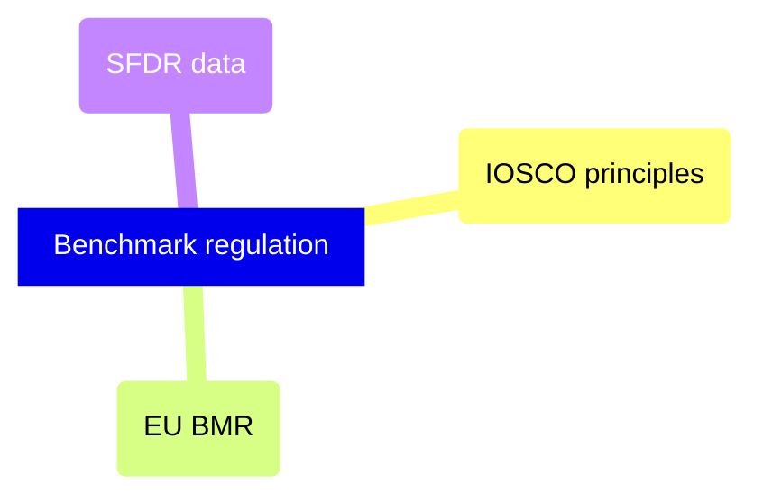

# Regulatory

Financial benchmark regulation — IOSCO principles, EU BMR administrator obligations, and SFDR sustainability disclosure data requirements.

> [!abstract]- [[iosco-benchmark-principles]]
>
> - [[iosco-benchmark-principles#The 19 Principles by Theme|The 19 principles by theme]]
> - [[iosco-benchmark-principles#Compliance Checkpoints for Data Engineers|Compliance checkpoints]]

> [!abstract]- [[eu-bmr-benchmark-regulation]]
>
> - [[eu-bmr-benchmark-regulation#Administrator Obligations (Articles 5-16)|Administrator obligations]]
> - [[eu-bmr-benchmark-regulation#Technical Compliance Checklist|Technical compliance checklist]]

> [!abstract]- [[sfdr-data-requirements]]
>
> - [[sfdr-data-requirements#Article Classification (Pipeline Perspective)|Article classification]]
> - [[sfdr-data-requirements#Principal Adverse Impact (PAI) Indicators|PAI indicators]]
> - [[sfdr-data-requirements#Data Vendor Mapping to PAI Indicators|Data vendor mapping]]

> [!abstract]- [[esg-circuit-breaker-fired]]
>
> - [[esg-circuit-breaker-fired#Trigger Conditions|Trigger conditions]]
> - [[esg-circuit-breaker-fired#Containment Actions|Containment actions]]
> - [[esg-circuit-breaker-fired#Recovery Checklist|Recovery checklist]]
